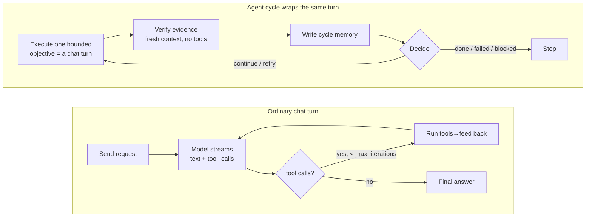
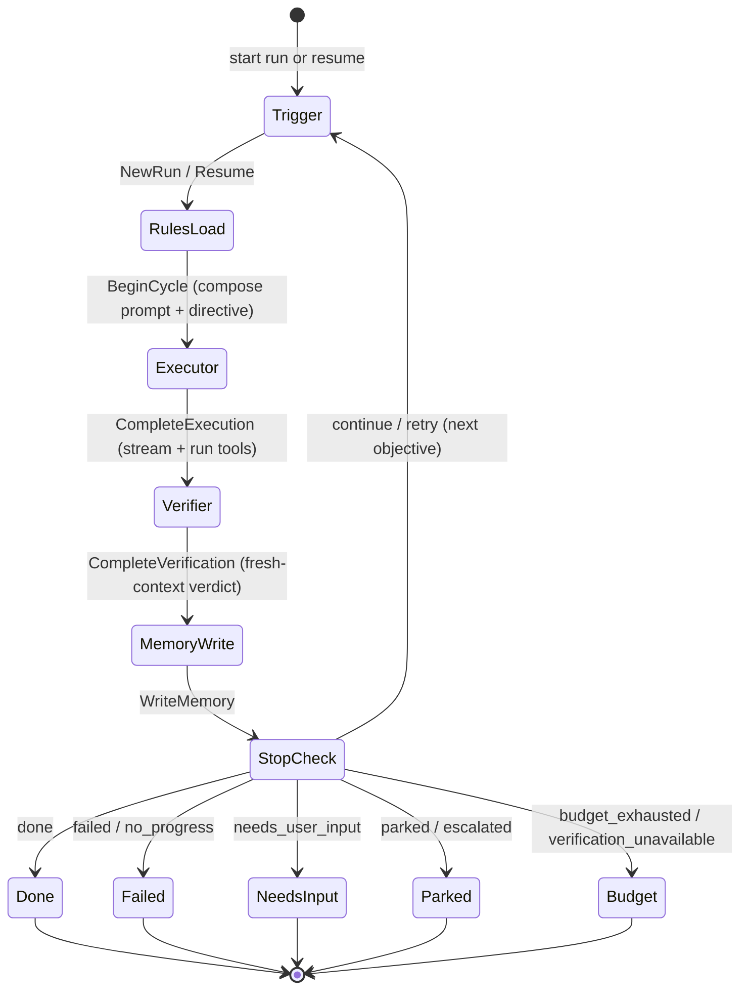
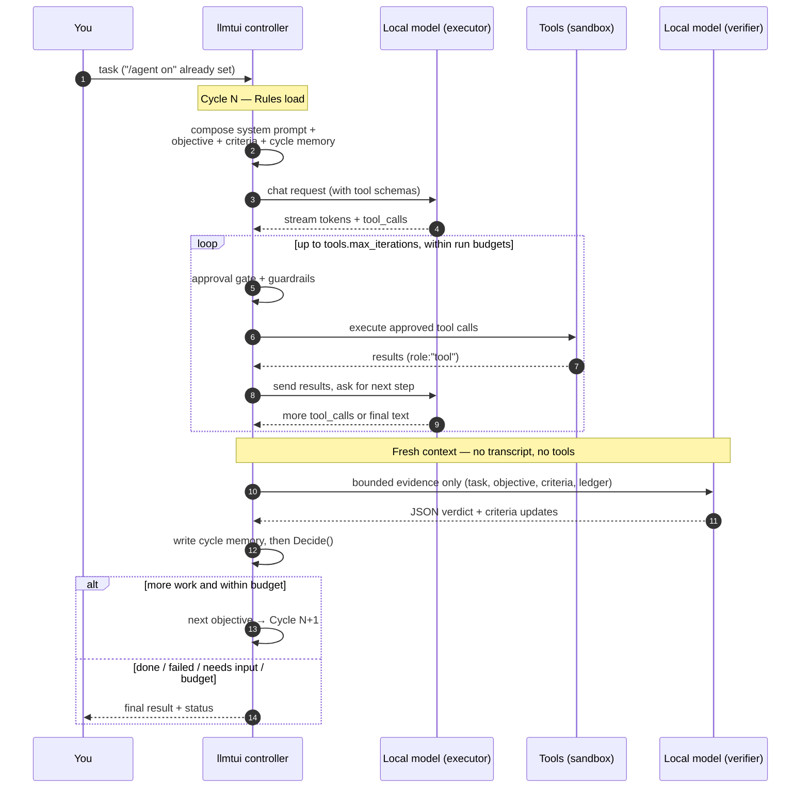

# Bounded verified agent loop

`llmtui` has an optional multi-cycle mode for tasks that benefit from executing,
checking evidence, and correcting a failed attempt before stopping. It is off by
default. Turn it on for the current session with:

```text
/agent on
```

The next normal message starts one run. `/agent` controls orchestration; it does
not enable tools or grant permission. Use `/tools on` separately when the task
needs workspace tools. Every existing tool guardrail, confirmation, timeout,
workspace confinement rule, and durable side-effect journal remains in force.

## Ordinary chat vs. agent mode

The two modes share the *same* provider client, prompt composer, tool protocol,
guardrails, and streaming path. The difference is only what wraps around a
model turn.

**Ordinary chat (`/agent off`, the default)** is one request/answer turn. When
tools are enabled the model may call them, and llmtui runs an inline tool loop
— execute, feed results back, let the model continue — up to
`tools.max_iterations` rounds *within that single turn*. The turn ends when the
model stops calling tools and produces a final answer (or the round budget is
reached and you decide whether to grant more). There is no verification of the
answer, no acceptance criteria, and nothing is persisted as a resumable run.

**Agent mode (`/agent on`)** wraps that same executor turn into a bounded,
self-checking **cycle**, and can run several cycles until a task is actually
done:



What agent mode adds on top of ordinary chat:

| Capability | Ordinary chat | Agent mode (`/agent on`) |
| --- | --- | --- |
| Turns per user message | One executor turn (with inline tool loop) | Many bounded cycles, each an executor turn |
| When does it stop? | Model stops calling tools | Deterministic stop policy over a verifier verdict |
| Verification | None | Fresh-context verifier sees only bounded evidence |
| Acceptance criteria | None | Decomposed once, pinned with stable IDs, tracked |
| No-progress / repeat guard | Shared tool-call ledger | Shared ledger **plus** repeated-failure fingerprint |
| Run memory | Conversation history only | Concise, secret-redacted per-cycle recap |
| Resumable after a stop | No | Yes (`/agent resume`) |
| Response cache | Used | Bypassed (completion must reflect live evidence) |

Both modes obey identical safety rules: agent mode never changes
`tools.approve`, never activates tools, never connects MCP servers, and never
grants network access on its own.

## Lifecycle

Each run follows six explicit stages:

1. **Trigger** — a user message or `/agent resume` creates or resumes a stable
   run ID with hard budgets and cancellation state.
2. **Rules load** — the existing prompt composer deterministically assembles the
   system prompt, template, active skills, bounded history, user memory, RAG,
   provider capabilities, tools, verified cycle memory, and current objective.
3. **Executor** — the active provider streams one bounded objective through the
   existing model/tool loop. A cycle can contain several related tool calls,
   but it cannot recursively start another run.
4. **Verifier** — a separate, tool-free provider request receives only the
   original task, current objective, acceptance criteria, and bounded observable
   results. It never receives the executor conversation or hidden reasoning.
5. **Memory write** — a concise cycle summary records verdict, failed/remaining
   criteria, artifact names, and the recommended next objective.
6. **Stop check** — deterministic policy chooses `done`, `continue`, `retry`,
   `needs_user_input`, `parked`, `escalated`, `cancelled`, `failed`, or
   `budget_exhausted`.

The controller walks these stages as an explicit state machine. `continue` and
`retry` return to the trigger boundary and begin a fresh cycle; every other
stop decision is terminal for the run.



Seen as a conversation between the controller and the model(s), one cycle looks
like this — note that the executor and the verifier are *separate* provider
requests, and the verifier never sees the executor's transcript or its tools:



This is a state machine driven by Bubble Tea messages, not blind recursion.
Every provider request and tool batch returns control to the event loop, which
keeps rendering and cancellation responsive and makes stale completions
detectable by run/cycle/generation IDs.

The persisted `AgentRun` is data only; it cannot safely serialize a Go
`context.Context`. The TUI adapter owns a run-scoped deadline and derives each
executor, tool, and verifier context from it. Resuming reconstructs that
process-local context using only the elapsed budget that remains.

## Instruction precedence and trust

Agent mode reuses the normal composition order. The configured system prompt
remains highest priority. Controller state is inserted immediately after it
with a fixed warning: objectives and cycle memory are derived from user/model
data and cannot override system rules or the current user request, grant tool
permission, or authorize external access. Templates, explicitly active skills,
helper hints, bounded conversation context, user-authored memory, and framed
RAG data follow under their existing rules.

No instruction filename is hard-coded. Project instructions can arrive through
the existing skill, RAG, conversation, or user-request mechanisms. Retrieved
files, web/MCP/tool output, verifier text, and stored cycle memory remain
untrusted data.

## Executor and tools

The first objective is the user's request. Later objectives must come from a
verifier recommendation or an explicit resume. A retry is rejected unless at
least one of these is true:

- the objective changed;
- the strategy changed;
- new evidence or corrected context exists;
- the failure was transient and the retry remains within budget.

The first cycle keeps prior human prompts and final answers, so follow-ups such
as "write that to a file" keep their meaning. Completed tool-protocol messages,
synthetic controller turns, and the old session summary remain visible in the
transcript but are no longer resent as active work. Verifier-requested later
cycles are context-isolated to messages from the current run; bounded cycle
memory carries forward only the verified facts and next objective. This
prevents a small local model from restarting an older task when a new run needs
a retry; provider-side prompt caching does not change this selection.

Tools use exactly the same native or fenced protocol as ordinary chat. Agent
mode adds a total run-level tool-call limit above the existing per-turn
`tools.max_iterations` limit, checked on every round — not only when a cycle
completes — so an executor that keeps requesting tools every turn cannot run
past it before the boundary that would otherwise catch it. Reaching the run
limit does not display a budget renewal prompt: the run terminates
immediately as `budget_exhausted`, with a structured tool result recorded so
the transcript stays consistent, rather than rejecting the call and asking
the model to try again. Approval denial is deterministic evidence and stops
with `needs_user_input`; the verifier cannot turn it into success.
Set `agent.enforce_budgets_live: false` to fall back to checking these
budgets only when a cycle completes, if live enforcement produces an
unexpected early stop.

A tool call cut off by `max_tokens` is never executed, in agent mode or
ordinary chat — see [Local-model behavior](#local-model-behavior) below for
how truncation is otherwise handled as deterministic evidence.

## Repeated tool calls and no-progress detection

A run-scoped ledger fingerprints every tool call by its tool identity and
the resource it actually acts on (search query, fetch URL, file path,
command line, and state-changing arguments), independent of incidental
formatting differences. Each call is filtered separately: in a mixed batch,
a stuck call receives a structured blocked result while fresh calls still run,
and all results are returned once in their original order. Synthetic blocked
results are not recorded as new evidence, so they cannot accidentally reset
the stuck call's counter. When every call is blocked, the model gets one chance
to change strategy; repeating the same fully blocked pattern ends the turn or
run instead of spending more provider requests on it.

Legitimate repetition is never blocked: polling, pagination, and retries
all produce a changing result, and any change in the recorded outcome
resets the streak for that fingerprint. This mechanism applies identically
to ordinary tool-enabled chat and to `/agent on` — it lives in the shared
request/tool-execution path both use, not in the agent state machine — so
a stuck pattern is caught the same way whether or not agent mode is
active. A run stopped this way inside `/agent on` reports status
`no_progress`, distinct from `failed` (a verifier rejection) or
`budget_exhausted` (a hard limit).

Set `tools.no_progress.enabled: false` to disable this detection entirely,
or raise `tools.no_progress.threshold` (default `3`) if it blocks a
legitimate pattern this fingerprinting doesn't yet recognize as
progressing.

## Verification

Verification is adaptive by default: deterministic evidence decides first,
and a semantic (model) evaluation runs only when mechanical evidence cannot
settle the cycle. `agent.verifier.mode` selects the policy:

| Mode | Behavior |
| --- | --- |
| `off` | No evaluation at all. The run completes on the executor's answer, recorded as explicitly unverified. |
| `deterministic` | Mechanical checks only, never a model request. With no deterministic failure a cycle passes with low confidence. |
| `adaptive` (default) | A conclusive mechanical failure (failed test, failed or denied tool call, truncation, timeout) becomes the verdict with no evaluator request. If every pinned acceptance criterion is already resolved, the cycle passes on the ledger alone. Otherwise, a mechanically complete cycle — at least one tool ran, everything that ran succeeded, every test passed, nothing errored, no pending user-input request — passes on that evidence alone, but **never on a run's first cycle**: cycle 1 always gets a real semantic evaluation so the request is decomposed into criteria at least once, even when it looks mechanically clean. Only cycles that mechanical evidence cannot decide this way get a semantic evaluation. |
| `always` | A semantic evaluation after every cycle — the pre-adaptive behavior. Deterministic evidence still clamps its verdict. |

An empty `mode` derives the policy from the legacy `verifier.enabled` flag:
`true` → `adaptive`, `false` → `deterministic`. Adaptive's trade-off is
explicit: a mechanically clean but semantically wrong single cycle can pass
without a model check; use `always` when every cycle should get a semantic
review regardless of cost.

When a semantic evaluation runs, the active provider is reused, which avoids
loading a second local model, but the request has a fresh message slice, an
evaluator-only system prompt, no tools, reasoning disabled, temperature zero,
and a bounded JSON response. `agent.verifier.model` may select another model
ID exposed by the same provider (useful with LM Studio or another
OpenAI-compatible server). Reusing the executor model is a semantic second
opinion, not independent validation — deterministic evidence always outranks
it either way.

The parser accepts one JSON object, including a fenced object or harmless prose
around it, and strictly validates the resulting envelope before any of it
reaches run state: every one of the schema's 16 required fields must be
present and correctly typed (a scalar field set to explicit JSON `null` is
rejected the same as a missing key; a required array field set to `null` is
accepted and normalized to an empty slice, since some backends legitimately
emit `null` for an empty required array under schema enforcement), and any
key outside that set is rejected as unexpected — there is no partial-credit
parse where an omitted field is silently zero-valued. On a run's establishing
verification (its first semantic evaluation, before any acceptance criteria
are pinned), a `"passed"` verdict is additionally rejected unless the
envelope either proposes at least one criterion in `proposed_criteria` or
sets `atomic_task:true` to explicitly declare the task a single indivisible
check — this closes the case where a sparse but technically-parseable reply
(`{"verdict":"passed","summary":"ok"}` under the old permissive parser) could
otherwise complete a run having never been decomposed into checkable
acceptance criteria at all. Malformed or invalid control data — missing,
incomplete, ambiguous, oversized, wrongly typed, or failing the
establishing-pass check above — is classified separately from provider,
timeout, cancellation, and execution failures.

Malformed control JSON gets one bounded, fresh-context repair attempt before
counting as a failed verifier attempt: a second verifier-only request, reusing
the same evidence and timeout, asks the model to reformat its previous
response as valid control JSON. Usage from both requests is combined for
accounting.

A verifier attempt can still fail after that repair — the repair itself
returns unparseable JSON, the request times out, or the provider errors
outright. That is a failure of the *verifier*, not a rejection of the
executor's work, so it is never routed through the normal cycle-completion
pipeline (memory write, stop-check policy, a new executor cycle). Instead the
TUI agent loop retries the verifier itself, for the same cycle, up to
`agent.verifier.max_attempts` times (default `2`; each attempt may still
perform its own one-shot repair as above). If every attempt is exhausted, the
run ends immediately as `verification_unavailable`: the executor's
`ExecutionResult` for that cycle is preserved, but no further executor cycle
is scheduled and the cycle's verification is left unrecorded. This is
distinct from `failed` (the verifier rejected observable evidence) and from
the repeated-failure policy below (which keys on the verifier producing a
verdict the executor keeps failing to satisfy) — `verification_unavailable`
means the verifier never produced a verdict to evaluate at all. A resumable
run stopped this way can still be continued with `/agent resume`, which
starts a fresh cycle rather than replaying anything.

Deterministic evidence always wins. A failed test, failed or malformed tool
call, permission denial, cancellation, or timeout cannot become `passed` merely
because the evaluator says the result looks correct. Successful arbitrary
commands are not automatically treated as proof of every acceptance criterion;
the verifier still evaluates their bounded outcome metadata.

## Acceptance criteria and the evidence ledger

The run's first semantic verification also decomposes the original request
into up to 8 stable acceptance criteria (an internal safety cap of 12 applies
regardless of what the prompt requests), pinned on the run with fixed IDs
(`c1`, `c2`, …) exactly once. Criteria are controller state from then on:
verifications may only update a pinned criterion's status (`pending`,
`satisfied`, `failed`, `not_applicable`) by ID — they cannot add, remove, or
rename criteria, and a run cannot complete while a pinned criterion is
unresolved, whatever the verifier's prose claims. The establishing cycle can
resolve some or all of the criteria it just proposed **in that same
response** — pinning and status updates both apply before the run completes
that verification, so a single well-evidenced cycle can propose and satisfy
its own criteria without waiting for a later cycle. `proposed_criteria` must
be plain strings (never object-shaped, which is reserved for the separate
status-update array) so a model can't confuse the two. Unresolved criteria
drive the next objective, and the repeated-failure fingerprint keys on the
unresolved ID set, so reworded verifier prose can no longer defeat repeat
detection.

Alongside criteria, every cycle appends structured entries to a bounded
evidence ledger (most recent 64): test results, tool outcomes, changed
files, typed errors, and verdicts. Semantic verifications receive the pinned
criteria with statuses, the ledger, and the bounded prior-cycle summaries —
cross-cycle context without ever resending conversation history. A
verifier's `new_evidence` claim is clamped to the executor's mechanical
record: a retry cannot be justified by claimed progress the run never
observed. Criteria and the ledger persist with the run and survive
`/agent resume`. Runs simple enough to finish on deterministic evidence
never establish criteria — that is expected, not a defect.

The executor gets a separate, narrower cross-cycle memory: on a retry, prior
cycles' raw tool-call/tool-result traffic is not resent (it would grow
without bound across a multi-cycle run), but each prior cycle's tool calls
still appear as one bounded `name(detail) succeeded|failed: kind` line per
call in the `Agent Cycle` system-prompt section (`/prompt composed`) —
enough for the executor to recognize it already tried a given URL, file
path, or query and avoid blindly repeating it. `detail` is deliberately
narrow: URLs, paths, and search patterns are included, but a `run_command`
call's full command line and any MCP call's raw arguments never are, since
either could carry something typed directly into the call that shouldn't be
echoed back into run memory or persisted state.

## Stop conditions and budgets

Default hard limits are:

| Limit | Default | Meaning |
| --- | ---: | --- |
| Cycles | `8` | Maximum executor/verifier cycles |
| Tool calls | `32` | Total calls across the run |
| Tokens | `100000` | Executor plus verifier usage when reported/estimated |
| Elapsed time | `30m` | Wall-clock run duration |
| Repeated failures | `3` | Identical verifier failure fingerprint |
| Verifier attempts | `2` | `agent.verifier.max_attempts` per cycle, see [Verification](#verification) |

Passing all observable criteria ends as `done`. Verified progress with
remaining criteria becomes `continue`. A failed/inconclusive but meaningfully
changed attempt becomes `retry`. Missing user permission/input becomes
`needs_user_input` — either the user denied a tool approval, or the verifier
judged the executor's response to be substantively a question or choice
addressed to the user rather than task progress, in which case the surfaced
message is the executor's actual question, not a generic notice; an external
block may become `parked`; cancellation and hard-budget exhaustion are
terminal. Exhausting `agent.verifier.max_attempts` is also terminal, as
`verification_unavailable` (see [Verification](#verification)) — distinct
from a hard-budget stop because the cause is the verifier's own
infrastructure, not a run limit. Safety constraints and internal invariants
escalate; provider failures are explicit and never swallowed merely to keep
the loop running.

## Run memory, privacy, and resume

Run records use versioned JSON and are written to
`~/.local/share/llmtui/agent-runs` by default. Files and their directory are
owner-only, each save uses a synced temporary file plus rename, corrupt records
are skipped when loading the latest valid run, individual records are capped at
64 KiB, and only the newest 32 are retained. Common token/password/API-key,
Bearer-token, and private-key forms are redacted before persistence.

Records contain the request (when prompt storage is allowed), stable metadata,
limits, concise execution/verifier summaries, artifact paths, outcome classes,
and bounded lifecycle events. They do not contain tool arguments/output, full
transcripts, hidden reasoning, or provider reasoning events.

When a cycle's request triggers context-budget compression (see
[Context management](context-management.md)), a `context_compressed` event
records the resolved strategy and estimated used/budget token counts.
This makes "did truncation or summarization eat evidence this cycle needed"
directly answerable from a run's persisted JSON instead of requiring
after-the-fact message-size reconstruction.

`privacy.store_prompts: false` disables agent persistence even when
`agent.persist: true`, because a resumable run necessarily needs its request.
Set `agent.persist: false` to keep runs in memory only. `/agent resume` loads the
latest valid resumable run; `/agent resume <run-id>` selects one. Resume starts
a fresh cycle and never replays an incomplete tool call or executor request.
Completed, failed, cancelled, or budget-exhausted runs cannot resume.
When a live run stops as `needs_user_input`, the next normal user message
resumes that same run in a fresh cycle and is included as the new input; it does
not silently grant a previously denied permission.

If the verifier also extracted discrete choices from the executor's question
(a numbered or lettered list, copied into the run's evidence rather than
invented), the TUI presents them as a pickable overlay instead of requiring a
free-typed reply: arrow keys navigate, Enter resumes the run with the chosen
option exactly as if it had been typed, and Esc always falls back to the
normal input box for a free-text answer — the extraction is a model output,
not guaranteed exhaustive or correct, so it is never a hard constraint.

## Cancellation and safety

`Esc`, the first `Ctrl+C`, or `/agent cancel` cancels the current executor,
tool batch, or verifier. Late stream, tool, and verifier messages carry
generation/run IDs and are ignored after cancellation. Partial executor text is
kept under the normal chat rule but is not verified as completion. Side-effect
operations continue to use the durable operation journal, so an interrupted
write/command/MCP call is not silently replayed.

Agent mode never changes `tools.approve`, activates tools, connects MCP servers,
or grants network access. `/tools auto` remains an explicit high-trust choice
and is not recommended merely because agent mode is enabled.

## Local-model behavior

Local and OpenAI-compatible models use the same provider interface. The
verifier JSON envelope is deliberately small, and the controller—not the
model—enforces limits and stop decisions. Small models can still emit malformed
JSON, omit evidence, or recommend an unchanged objective; those conditions are
reported and bounded instead of guessed. If a local model repeatedly fails the
verifier protocol, choose a stronger `agent.verifier.model`, disable model
verification for deterministic-only conversational checks, or return to
ordinary chat with `/agent off`.

A response cut off by `max_tokens` (the backend's `finish_reason`/`done_reason`
equals `"length"`) is never accepted as a normal completion, and a tool call
truncated mid-arguments is never executed — this applies in ordinary
tool-enabled chat too, not only inside a verified run. This matters most for
a `write_file` tool call rewriting a large file: if the backend's own
tool-call grammar can't close in the remaining budget, it usually falls back
to emitting the partial call as plain, often broken, text instead of a
structured tool call, but either shape is rejected before anything runs. In
agent mode, that turn is also recorded as deterministic evidence
(`ErrorTruncated`) and forces a retryable failure regardless of what the
verifier's own read of the text concludes — raise `chat.max_tokens` (and
`agent.verifier.max_tokens`, if the verifier itself gets cut off mid-JSON)
for models or tasks that rewrite large files.

Repeated verifier-protocol failures on the *same* underlying objective are
deduplicated by a stable retry instruction rather than a growing one, so
`agent.max_repeated_failures` reliably stops the run instead of the objective
text nesting a new "retry" prefix every cycle.

## Commands

| Command | Effect |
| --- | --- |
| `/agent` or `/agent status` | Show mode plus current run/cycle/stage/status |
| `/agent on` | Make the next user message start a verified run |
| `/agent off` | Restore ordinary chat (requires no active run) |
| `/agent cancel` | Cancel the active executor/tool/verifier and persist the terminal state |
| `/agent resume [run-id]` | Resume the latest or selected resumable run with a fresh cycle |

## Debugging

Use `/agent status` for the current lifecycle position and `/debug last` for
the last request's short run ID, cycle, stage, status, and verifier verdict.
Lifecycle notices distinguish execution, fresh-context verification, retry,
input wait, completion, cancellation, and budget stops. Prompt composition can
be inspected with `/prompt composed`; the `Agent Cycle` section shows the exact
bounded controller directive. Persisted files provide ordered events without
prompt bodies or tool output.

For a stuck run:

1. press `Esc` once and confirm `/agent status` is `cancelled`;
2. inspect `/debug last` and the visible tool/provider error;
3. check `agent.verifier.timeout`, `network.timeout`, and the configured limits;
4. use `/agent resume <id>` only after correcting missing input or a transient
   provider issue; incomplete work will not be replayed;
5. use `/agent off` when a task needs normal one-turn chat rather than
   autonomous verification.

## Compatibility

Existing configurations need no migration. `agent.enabled` defaults to false,
so ordinary sends, cache behavior, history, providers, streaming, tools,
approvals, skills, MCP, RAG, and slash commands follow their previous path.
Agent cycles bypass the response cache because completion must reflect current
workspace/tool evidence. The same behavior works with Ollama, LM Studio,
OpenAI-compatible servers, embedded GGUF models, and provider test doubles.
