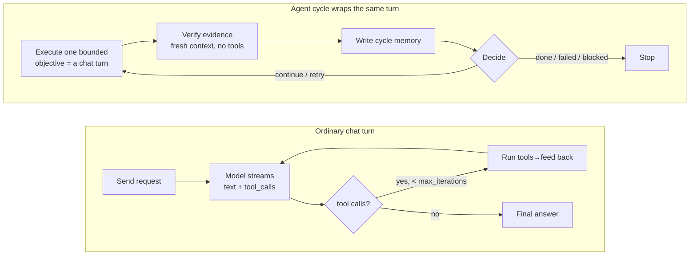
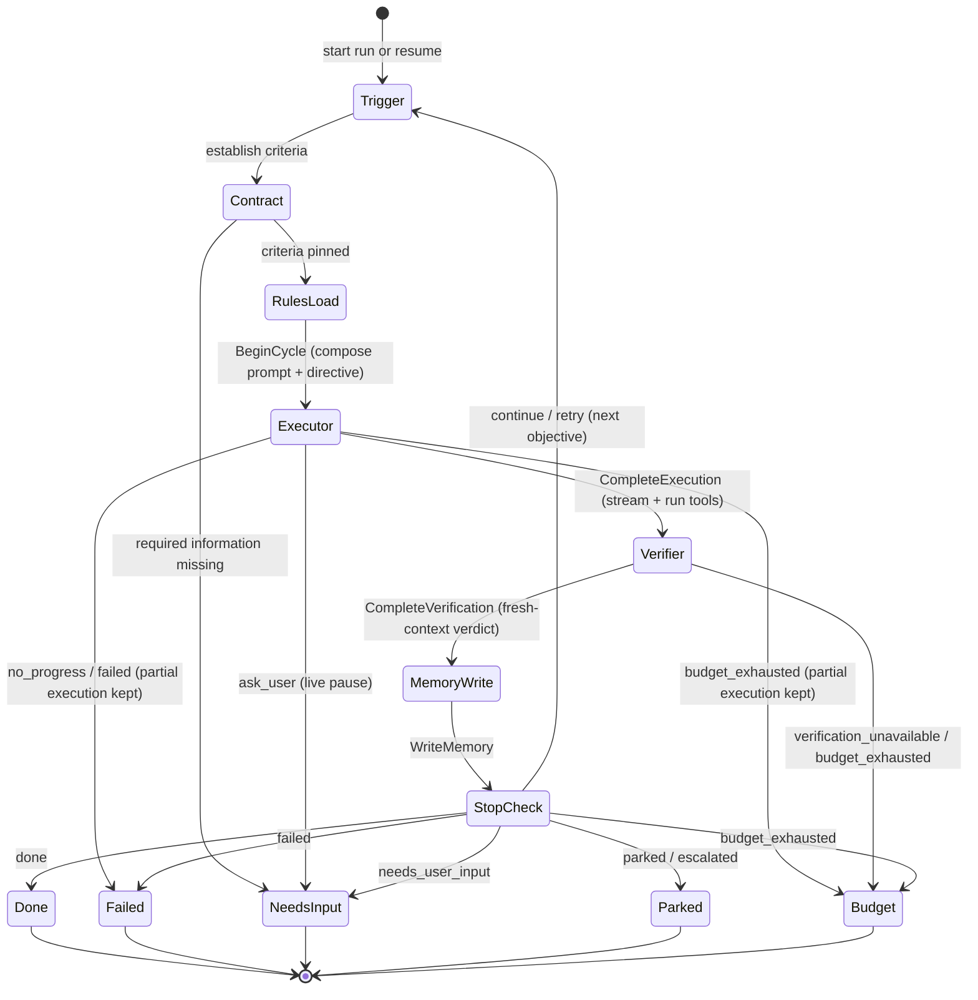
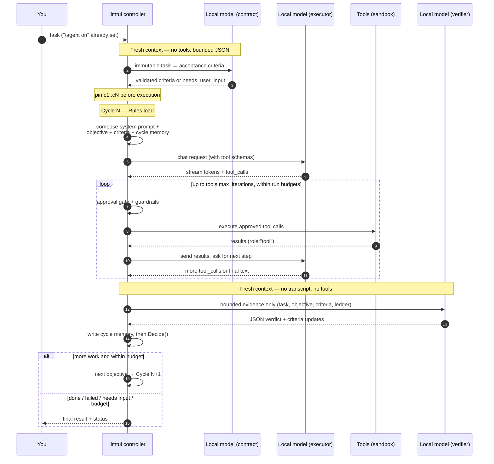

# Bounded verified agent loop

`llmtui` has an optional multi-cycle mode for tasks that benefit from executing,
checking evidence, and correcting a failed attempt before stopping. It is off by
default. Turn it on for the current session with:

```text
/agent on
```

The next normal message starts one run. `/agent` controls orchestration; it does
not enable tools or grant permission. Use `/tools on` separately when the task
needs workspace tools. Every existing tool guardrail, confirmation, timeout,
workspace confinement rule, and durable side-effect journal remains in force.

## Ordinary chat vs. agent mode

The two modes share the *same* provider client, prompt composer, tool protocol,
guardrails, and streaming path. The difference is only what wraps around a
model turn.

**Ordinary chat (`/agent off`, the default)** is one request/answer turn. When
tools are enabled the model may call them, and llmtui runs an inline tool loop
— execute, feed results back, let the model continue — up to
`tools.max_iterations` rounds *within that single turn*. The turn ends when the
model stops calling tools and produces a final answer (or the round budget is
reached and you decide whether to grant more). There is no verification of the
answer, no acceptance criteria, and nothing is persisted as a resumable run.

**Agent mode (`/agent on`)** wraps that same executor turn into a bounded,
self-checking **cycle**, and can run several cycles until a task is actually
done:


```mermaid
flowchart LR
    subgraph chat[Ordinary chat turn]
        direction LR
        c1[Send request] --> c2[Model streams<br/>text + tool_calls]
        c2 --> c3{tool calls?}
        c3 -->|yes, &lt; max_iterations| c4[Run tools→feed back]
        c4 --> c2
        c3 -->|no| c5[Final answer]
    end
    subgraph agent[Agent cycle wraps the same turn]
        direction LR
        a1[Execute one bounded<br/>objective = a chat turn] --> a2[Verify evidence<br/>fresh context, no tools]
        a2 --> a3[Write cycle memory]
        a3 --> a4{Decide}
        a4 -->|continue / retry| a1
        a4 -->|done / failed / blocked| a5[Stop]
    end
```

What agent mode adds on top of ordinary chat:

| Capability | Ordinary chat | Agent mode (`/agent on`) |
| --- | --- | --- |
| Turns per user message | One executor turn (with inline tool loop) | Many bounded cycles, each an executor turn |
| When does it stop? | Model stops calling tools | Deterministic stop policy over a verifier verdict |
| Verification | None | Fresh-context verifier sees only bounded evidence |
| Acceptance criteria | None | Decomposed once, pinned with stable IDs, tracked |
| No-progress / repeat guard | Shared tool-call ledger | Shared ledger **plus** repeated-failure fingerprint |
| Run memory | Conversation history only | Concise, secret-redacted per-cycle recap |
| Resumable after a stop | No | Yes (`/agent resume`) |
| Response cache | Used | Bypassed (completion must reflect live evidence) |

Both modes obey identical safety rules: agent mode never changes
`tools.approve`, never activates tools, never connects MCP servers, and never
grants network access on its own.

## Calibration and assistance

The runtime keeps integrity fixes and experimental assistance separate. Tool
receipts, proof/freshness checks, bounded recovery, context accounting, and
approval gates are controller rules. They remain active regardless of any
assistance experiment.

The current format-assistance tracker is shadow-only: it records repeated
control-format failures for the selected model and reports a reversible
recommendation in `/debug`, but it does not change prompts, select a model, or
route a request. No automatic assistance default has been adopted. The
synthetic baseline, opt-in endpoint procedure, denominators, and saved-state
compatibility gate are documented in [agent-evaluation.md](agent-evaluation.md).

A second shadow tracker, the Laya decision-engine advisor, runs alongside the
format-assistance tracker when `decision_engine.enabled` is true: after
`agent.Decide()` resolves each cycle, a compact, bounded snapshot of the
cycle's observable state (task, objective, acceptance-criteria statuses, tool
outcomes, changed files, test results — never the raw transcript, hidden
reasoning, or full tool output) is sent to the configured Laya model, and its
`cycle_action`/`goal_complete`/`semantic_verifier_needed` predictions are
recorded in `/debug last` next to the authoritative decision. Like the
format-assistance tracker, this is shadow-only: no prediction changes
verifier mode, skips verification, forces success, ends a run, or authorizes
anything. A second, earlier Laya observation runs immediately after
deterministic criteria are applied — before any verifier call exists —
asking only whether semantic verification looks needed, specifically to
calibrate the future one-way escalation gate described below; it is
reconciled against the cycle's later actual outcome and is equally
shadow-only. See [decision-engine.md](decision-engine.md) for both
observations, the engine itself, the Snake-demo design analogy, and the
future-phase roadmap.

## Lifecycle

Each run establishes a contract, then follows the execution stages:

1. **Trigger** — a user message or `/agent resume` creates or resumes a stable
   run ID with hard budgets and cancellation state.
2. **Task contract** — a bounded, fresh-context, tool-free control request
   decomposes the immutable user request into stable acceptance criteria. The
   controller pins IDs (`c1`, `c2`, …) before an executor request or tool call
   is possible. If essential information is missing, the run stops for user
   input before execution.
3. **Rules load** — the existing prompt composer deterministically assembles the
   system prompt, template, active skills, bounded history, user memory, RAG,
   provider capabilities, tools, verified cycle memory, and current objective.
4. **Executor** — the active provider streams one bounded objective through the
   existing model/tool loop. A cycle can contain several related tool calls,
   but it cannot recursively start another run. The cycle's first request
   carries the `Agent Cycle` directive in its system message; its tool-round
   and yield continuations repeat that system message byte for byte and send
   the *current* directive in a runtime-context message after history (see
   [prompt composition](prompt-composition.md)), so the prompt prefix stays
   reusable across rounds.
5. **Verifier** — a separate, tool-free provider request receives only the
   original task, current objective, acceptance criteria, and bounded observable
   results. It never receives the executor conversation or hidden reasoning.
   Contract and verifier requests set `provider.ChatRequest.Isolated`; the
   embedded provider evaluates them in a separate llama.cpp sequence so they
   do not evict the executor's cached prompt (see [embedded](embedded.md)).
   Remote providers ignore the hint.
6. **Memory write** — a concise cycle summary records verdict, failed/remaining
   criteria, artifact names, and the recommended next objective.
7. **Stop check** — deterministic policy chooses `done`, `continue`, `retry`,
   `needs_user_input`, `parked`, `escalated`, `cancelled`, `failed`, or
   `budget_exhausted`.

The controller walks these stages as an explicit state machine. `continue` and
`retry` return to the trigger boundary and begin a fresh cycle; every other
decision stops the current execution. A run can also stop before the stop
check: inside the executor as `no_progress`, `budget_exhausted`, `failed`, or
(from a yield decision) `escalated`/`cancelled`, and at the verifier as
`verification_unavailable` or `budget_exhausted`. `needs_user_input`,
`parked`, and `verification_unavailable` are resumable (`/agent resume`); the
others are final.


```mermaid
stateDiagram-v2
    [*] --> Trigger: start run or resume
    Trigger --> Contract: establish criteria
    Contract --> RulesLoad: criteria pinned
    Contract --> NeedsInput: required information missing
    RulesLoad --> Executor: BeginCycle (compose prompt + directive)
    Executor --> Verifier: CompleteExecution (stream + run tools)
    Executor --> Failed: no_progress / failed (partial execution kept)
    Executor --> Budget: budget_exhausted (partial execution kept)
    Executor --> NeedsInput: ask_user (live pause)
    Verifier --> MemoryWrite: CompleteVerification (fresh-context verdict)
    Verifier --> Budget: verification_unavailable / budget_exhausted
    MemoryWrite --> StopCheck: WriteMemory
    StopCheck --> Trigger: continue / retry (next objective)
    StopCheck --> Done: done
    StopCheck --> Failed: failed
    StopCheck --> NeedsInput: needs_user_input
    StopCheck --> Parked: parked / escalated
    StopCheck --> Budget: budget_exhausted
    Done --> [*]
    Failed --> [*]
    NeedsInput --> [*]
    Parked --> [*]
    Budget --> [*]
```

Seen as a conversation between the controller and the model(s), one cycle looks
like this — note that the executor and the verifier are *separate* provider
requests, and the verifier never sees the executor's transcript or its tools:


```mermaid
sequenceDiagram
    autonumber
    participant U as You
    participant C as llmtui controller
    participant P as Local model (contract)
    participant E as Local model (executor)
    participant T as Tools (sandbox)
    participant V as Local model (verifier)

    U->>C: task ("/agent on" already set)
    Note over C,P: Fresh context — no tools, bounded JSON
    C->>P: immutable task → acceptance criteria
    P-->>C: validated criteria or needs_user_input
    Note over C: pin c1..cN before execution
    Note over C: Cycle N — Rules load
    C->>C: compose system prompt +<br/>objective + criteria + cycle memory
    C->>E: chat request (with tool schemas)
    E-->>C: stream tokens + tool_calls
    loop up to tools.max_iterations, within run budgets
        C->>C: approval gate + guardrails
        C->>T: execute approved tool calls
        T-->>C: results (role:"tool")
        C->>E: send results, ask for next step
        E-->>C: more tool_calls or final text
    end
    Note over C,V: Fresh context — no transcript, no tools
    C->>V: bounded evidence only (task, objective, criteria, ledger)
    V-->>C: JSON verdict + criteria updates
    C->>C: write cycle memory, then Decide()
    alt more work and within budget
        C->>C: next objective → Cycle N+1
    else done / failed / needs input / budget
        C-->>U: final result + status
    end
```

This is a state machine driven by Bubble Tea messages, not blind recursion.
Every provider request and tool batch returns control to the event loop, which
keeps rendering and cancellation responsive and makes stale completions
detectable by run/cycle/generation IDs.

The persisted `AgentRun` is data only; it cannot safely serialize a Go
`context.Context`. The TUI adapter owns a run-scoped deadline and derives each
executor, tool, and verifier context from it. Resuming reconstructs that
process-local context using only the elapsed budget that remains.
`max_elapsed` measures active time: while the run waits for your answer
(`needs_user_input`, from `ask_user` or a contract question) the clock is
paused, and the deadline is renewed when you answer or resume. The run records
the paused total as `paused_for`. A parked or interrupted run is not waiting
for input, so its time still counts.

## Instruction precedence and trust

Agent mode reuses the normal composition order. The configured system prompt
remains highest priority. Controller state is inserted immediately after it
with a fixed warning: objectives and cycle memory are derived from user/model
data and cannot override system rules or the current user request, grant tool
permission, or authorize external access. Templates, explicitly active skills,
helper hints, bounded conversation context, user-authored memory, and framed
RAG data follow under their existing rules.

No instruction filename is hard-coded. Project instructions can arrive through
the existing skill, RAG, conversation, or user-request mechanisms. Retrieved
files, web/MCP/tool output, verifier text, and stored cycle memory remain
untrusted data.

## Executor and tools

The first objective is the user's request. Later objectives must come from a
verifier recommendation or an explicit resume. A retry is rejected unless at
least one of these is true:

- the objective changed;
- the strategy changed;
- new evidence or corrected context exists;
- the failure was transient and the retry remains within budget.

"New evidence" means new *information*, not activity: a successful result
whose content digest this run has not seen, a changed file, a user answer or
decision, or the first occurrence of an observational failure such as "that
path does not exist". Rereading unchanged content, a failed call, a
max_tokens truncation, or a call rejected for invalid arguments is not new
evidence. "Strategy changed" is only what the verifier explicitly reports;
it is no longer inferred from a non-empty `recommended_next`.

The tool-call budget (`agent.max_tool_calls`) counts calls that actually ran,
excluding `ask_user`, with one definition shared by the live check and the
cycle-boundary stop policy. A call rejected for invalid arguments ran nothing
and is recorded with status `rejected`, so it spends no tool budget. Invalid
calls are still bounded by the tool-round limit, the token budget, and the
repeat detector.

The first cycle keeps prior human prompts and final answers, so follow-ups such
as "write that to a file" keep their meaning. Completed tool-protocol messages,
synthetic controller turns, and the old session summary remain visible in the
transcript but are no longer resent as active work. Verifier-requested later
cycles are context-isolated to messages from the current run; bounded cycle
memory carries forward only the verified facts and next objective. This
prevents a small local model from restarting an older task when a new run needs
a retry; provider-side prompt caching does not change this selection.

Tools use exactly the same native or fenced protocol as ordinary chat. Agent
mode adds a total run-level tool-call limit above the existing per-turn
`tools.max_iterations` limit, checked on every round — not only when a cycle
completes — so an executor that keeps requesting tools every turn cannot run
past it before the boundary that would otherwise catch it. Reaching the run
limit does not display a budget renewal prompt: the run terminates
immediately as `budget_exhausted`, with a structured tool result recorded so
the transcript stays consistent, rather than rejecting the call and asking
the model to try again. Approval denial is deterministic evidence and stops
with `needs_user_input`; the verifier cannot turn it into success.
Set `agent.enforce_budgets_live: false` to fall back to checking these
budgets only when a cycle completes, if live enforcement produces an
unexpected early stop.

A tool call cut off by `max_tokens` is never executed, in agent mode or
ordinary chat — see [Local-model behavior](#local-model-behavior) below for
how truncation is otherwise handled as deterministic evidence.

A native batch whose results would not fit the next request no longer fails
the run: its newest results are cut to fit before they are recorded (see
[Context Management](context-management.md)). A cut `read_file` result
records only the line window it delivered, so it cannot satisfy a
whole-file read requirement or bind an edit as a complete observation; the
executor rereads the rest with `offset`/`limit`.

## Repeated tool calls and no-progress detection

A run-scoped ledger fingerprints every tool call by its tool identity and
the resource it actually acts on (search query, fetch URL, file path,
command line, and state-changing arguments), independent of incidental
formatting differences. Each call is filtered separately: in a mixed batch,
a stuck call receives a structured blocked result while fresh calls still run,
and all results are returned once in their original order. Synthetic blocked
results are not recorded as new evidence, so they cannot accidentally reset
the stuck call's counter. When every call is blocked, the model gets one chance
to change strategy; repeating the same fully blocked pattern ends the turn or
run instead of spending more provider requests on it.

Legitimate repetition is never blocked: polling, pagination, and retries
all produce a changing result, and any change in the recorded outcome
resets the streak for that fingerprint. This mechanism applies identically
to ordinary tool-enabled chat and to `/agent on` — it lives in the shared
request/tool-execution path both use, not in the agent state machine — so
a stuck pattern is caught the same way whether or not agent mode is
active. A run stopped this way inside `/agent on` reports status
`no_progress`, distinct from `failed` (a verifier rejection) or
`budget_exhausted` (a hard limit).

Set `tools.no_progress.enabled: false` to disable this detection entirely,
or raise `tools.no_progress.threshold` (default `3`) if it blocks a
legitimate pattern this fingerprinting doesn't yet recognize as
progressing.

## Same-episode yield continuation

A "yield" is a clean, no-tool assistant completion — it is not task
completion. By default (`agent.yield.enabled: true`) a narrow, mechanically
provable class of missing evidence continues in the *same* executor episode
before verification: currently only an exact
"Read the file `<path>`." acceptance criterion the executor has not yet
proven. This is not a general "keep retrying" mode — a criterion requiring
model judgment (comparison, review, open-ended inspection) is never treated
as an obligation here and always falls through to verification unchanged,
per [ADR 0013](architecture/decisions/0013-agent-execution-yield-policy.md).
Set `agent.yield.enabled: false` to send every yield straight to verification,
as before this feature existed.

Proof is coverage-aware, not just "a `read_file` call touching this path
succeeded": a successful read that only delivered part of a larger file
(e.g. lines 1-100 of a 220-line file) does not satisfy the criterion by
itself. The delivered line windows from every `read_file` call on the same
target this cycle are unioned — gaplessly, and only within one consistent
source version — and the criterion resolves once that union covers the
whole file. Windows from two different file versions (a changed
`SourceDigest`) are never combined into one coverage claim; a read of the
newer version supersedes the older version's windows.

Targets are compared in one canonical spelling on both sides — lowercased,
cleaned, with a leading `./` dropped — so a read of `./src/main.go` proves a
criterion naming `src/main.go`. Overlapping or adjacent windows for the same
target merge into one, so rereads and paging never use up the bounded
receipt list (32 windows per cycle); when it is full, the target read least
recently is dropped as a whole, never a single window of a file still being
read. For the no-progress nudge budget, progress on an obligation is a
strict increase in its contiguous covered lines over the episode's best so
far, so coverage that is lost and read again never counts as progress.

When an obligation is still outstanding and the required tool capability is
offered, the executor receives one more bounded request in the same cycle —
no new `BeginCycle`, no new user-facing message, no verifier dispatch — with
a small "Runtime execution state" directive naming the still-missing
criterion by its pinned ID. When enough is already known about the file
(its total line count and what has been delivered so far), the directive
names the exact remaining window — `read_file({"path":"...","offset":101,"limit":120})`
— instead of a generic "use the offered tool again"; it falls back to the
generic phrasing when no useful hint can yet be derived (no read of that
target has happened this cycle). Two independent bounds keep this from
looping:

| Bound | Config key | Default | Behavior when exceeded |
| --- | --- | --- | --- |
| Nudges without new progress | `agent.yield.max_nudges_without_progress` | `2` | Episode stops as `no_progress`, same as the no-progress detection above |
| Provider attempts per episode | `agent.yield.max_episode_requests` | `64` | Episode stops as `budget_exhausted` |

"Progress" here means the set of outstanding obligations changed since the
last continuation (a criterion was proven or dropped out), or an obligation's
contiguous covered lines rose above the episode's best so far — an unrelated
tool call, a longer answer, or re-reading lines that were already covered does
not reset the counter. A vision capture already in flight is finished first; the
capture's own completion callback re-enters this same decision point rather
than always jumping to verification.

## Verification

Verification is adaptive by default: deterministic evidence decides first,
and a semantic (model) evaluation runs only when mechanical evidence cannot
settle the cycle. `agent.verifier.mode` selects the policy:

| Mode | Behavior |
| --- | --- |
| `off` | No evaluation at all. The run completes on the executor's answer, recorded as explicitly unverified. |
| `deterministic` | Mechanical checks only, never a model request. With no deterministic failure a cycle passes with low confidence. |
| `adaptive` (default) | A conclusive mechanical failure (failed test, a failed or denied trailing tool call other than an observational `not_found`/`range_after_eof` read, truncation, timeout) becomes the verdict with no evaluator request. If every pinned acceptance criterion is already resolved, the cycle passes on the ledger alone. Otherwise, semantic verification evaluates the unresolved criteria. |
| `always` | A semantic evaluation after every cycle — the pre-adaptive behavior. Deterministic evidence still clamps its verdict. |

An empty `mode` derives the policy from the legacy `verifier.enabled` flag:
`true` → `adaptive`, `false` → `deterministic`. Adaptive skips the model
check only when mechanical evidence is conclusive: an observed failure, or
every pinned criterion already resolved (in practice, an exact-read criterion
proven by delivered read coverage). A clean cycle with unresolved criteria
always gets a semantic evaluation; use `always` to also review cycles whose
criteria the ledger already resolved.

Every pinned acceptance criterion is semantic: the task contract pins them,
and only the verifier resolves them — except an atomic "Read the file X"
criterion, which delivered read coverage proves mechanically. (Earlier
builds also defined test/command/file/user-input criterion kinds, but nothing
in the contract-first flow could create them; they were removed, and a run
saved with one loads it as a semantic criterion.) A semantic verifier's
`passed` must report a status per criterion ID: a bare `passed` over several
criteria is sent back once for per-ID statuses, and if it still has none, no
criterion is satisfied implicitly — the unresolved ones drive the next cycle.
In `deterministic` and `off` modes, where no semantic verifier runs, the
controller's own pass resolves the criteria as configured. Before
verification, the executor directive and the verifier input show
controller-computed read-coverage facts under each exact-read criterion
(for example `lines 1-120 of 300 of "report.md" delivered contiguously`);
they are observations only and never change a criterion's status.

A cycle whose **last** tool call failed is judged by what that failure was:

- An *observational* failure — a read-only tool (`read_file`, `list_dir`,
  `glob`, `grep`) reporting the typed code `not_found` or `range_after_eof` —
  is not a mechanical verdict. "The file does not exist" can be the answer,
  so the cycle goes to the semantic verifier like any other.
- Any other trailing failure is still a deterministic `failed` verdict, but it
  carries a controller-authored recovery objective (built only from the tool
  name, its recorded resource, and the typed error kind/code). That earns
  exactly one recovery cycle; the same failure in that cycle yields the same
  objective, and the stop policy then ends the run as `failed`.
- Permission denial, safety blocks, timeouts, and truncation are unchanged.

Typed tool error codes are persisted on each receipt as `error_code`
(additive; older records have none and keep the previous behavior).

When a semantic evaluation runs, the active provider is reused, which avoids
loading a second local model, but the request has a fresh message slice, an
evaluator-only system prompt, no tools, reasoning disabled, temperature zero,
and a bounded JSON response. When the verifier model is a GPT-OSS (Harmony)
model, which cannot disable reasoning, the request uses `low` effort instead.
`agent.verifier.model` may select another model
ID exposed by the same provider (useful with LM Studio or another
OpenAI-compatible server). Reusing the executor model is a semantic second
opinion, not independent validation — deterministic evidence always outranks
it either way.

While a semantic verifier request is running, a live row above the usage panel
shows its effective model, cycle, attempt, fresh-context boundary, and elapsed
time. The persistent status-bar model remains the selected executor model;
deterministic verification does not show a model activity row because no model
request is made.

The parser accepts one JSON object, including a fenced object or harmless prose
around it, and strictly validates the resulting envelope before any of it
reaches run state. Six fields are required — `verdict`, `summary`,
`recommended_next`, `retryable`, `needs_user_input`, and `criteria` (plus
`proposed_criteria` and `atomic_task` for an establishing verification) — and
each must be correctly typed: a scalar field set to explicit JSON `null` is
rejected the same as a missing key, while a required array field set to `null`
is accepted and normalized to an empty slice, since some backends legitimately
emit `null` for an empty required array under schema enforcement. A small set
of optional fields (`user_options`, `evidence`, `failed_criteria`,
`remaining_criteria`, `confidence`, `new_evidence`, `strategy_changed`,
`transient_failure`) takes a documented default when absent — for example
`confidence` 0.5 and `strategy_changed` false. Any key outside the required and
optional sets is rejected as unexpected. Contract control data is
validated with the same bounded, fenced-JSON-tolerant parser: an executable
contract must contain one to twelve non-empty criteria, while an ambiguous task
must contain a precise user question and no criteria. Malformed or invalid
control data is classified separately from provider, timeout, cancellation, and
execution failures; it parks the run without dispatching the executor.

Malformed control JSON gets one bounded, fresh-context repair attempt before
counting as a failed verifier attempt: a second verifier-only request, reusing
the same evidence and timeout, asks the model to reformat its previous
response as valid control JSON. Usage from both requests is combined for
accounting.

A verifier attempt can still fail after that repair — the repair itself
returns unparseable JSON, the request times out, or the provider errors
outright. That is a failure of the *verifier*, not a rejection of the
executor's work, so it is never routed through the normal cycle-completion
pipeline (memory write, stop-check policy, a new executor cycle). Instead the
TUI agent loop retries the verifier itself, for the same cycle, up to
`agent.verifier.max_attempts` times (default `2`; each attempt may still
perform its own one-shot repair as above). If every attempt is exhausted, the
run ends immediately as `verification_unavailable`: the executor's
`ExecutionResult` for that cycle is preserved, but no further executor cycle
is scheduled and the cycle's verification is left unrecorded. This is
distinct from `failed` (the verifier rejected observable evidence) and from
the repeated-failure policy below (which keys on the verifier producing a
verdict the executor keeps failing to satisfy) — `verification_unavailable`
means the verifier never produced a verdict to evaluate at all. A resumable
run stopped this way can still be continued with `/agent resume`, which
starts a fresh cycle rather than replaying anything.

Deterministic evidence always wins. A failed test, a failed or malformed
trailing tool call, permission denial, cancellation, or timeout cannot become
`passed` merely because the evaluator says the result looks correct. The one
exception is deliberate: an observational `not_found`/`range_after_eof` read
failure (see above) is evidence for the verifier to judge, because "the file
does not exist" can itself be the correct answer. Successful arbitrary
commands are not automatically treated as proof of every acceptance criterion;
the verifier still evaluates their bounded outcome metadata.

## Acceptance criteria and the evidence ledger

Before cycle 1, the tool-free task-contract stage decomposes the original
request into up to 8 stable acceptance criteria (an internal safety cap of 12
applies regardless of what the prompt requests), pinned on the run with fixed
IDs (`c1`, `c2`, …) exactly once. Criteria are controller state from then on:
verifications may only update a pinned criterion's status (`pending`,
`satisfied`, `failed`, `not_applicable`) by ID — they cannot add, remove, or
rename criteria, and a run cannot complete while a pinned criterion is
unresolved, whatever the verifier's prose claims. Unresolved criteria drive
the next objective, and the repeated-failure fingerprint keys on the
unresolved ID set, so reworded verifier prose can no longer defeat repeat
detection.

Alongside criteria, every cycle appends structured entries to a bounded
evidence ledger (most recent 64): test results, tool outcomes, changed
files, typed errors, and verdicts. Semantic verifications receive the still
unresolved pinned criteria, controller-computed read-coverage facts, the
ledger, and the bounded prior-cycle summaries —
cross-cycle context without ever resending conversation history. A
verifier's `new_evidence` claim is clamped to the executor's mechanical
record: a retry cannot be justified by claimed progress the run never
observed. Criteria and the ledger persist with the run and survive
`/agent resume`. Every run establishes its criteria in the task-contract stage
before cycle 1; a run cannot reach an executor without them.

The executor gets a separate, narrower cross-cycle memory: on a retry, prior
cycles' raw tool-call/tool-result traffic is not resent (it would grow
without bound across a multi-cycle run), but each prior cycle's tool calls
still appear as one bounded `name(detail) succeeded|failed: kind[/code]` line per
call in the `Agent Cycle` section (`/prompt composed`) —
enough for the executor to recognize it already tried a given URL, file
path, or query and avoid blindly repeating it. `detail` is deliberately
narrow: URLs, paths, and search patterns are included, but a `run_command`
call's full command line and any MCP call's raw arguments never are, since
either could carry something typed directly into the call that shouldn't be
echoed back into run memory or persisted state.

## Stop conditions and budgets

Default hard limits are:

| Limit | Default | Meaning |
| --- | ---: | --- |
| Cycles | `8` | Maximum executor/verifier cycles |
| Tool calls | `32` | Executed tool calls across the run, excluding `ask_user`; rejected, blocked, and denied calls do not count |
| Tokens | `100000` | Executor plus verifier usage when reported/estimated |
| Elapsed time | `30m` | Active run duration; time waiting for your answer (`needs_user_input`) is excluded |
| Repeated failures | `3` | Identical verifier failure fingerprint |
| Verifier attempts | `2` | `agent.verifier.max_attempts` per cycle, see [Verification](#verification) |
| Yield nudges without progress | `2` | `agent.yield.max_nudges_without_progress`, only when `agent.yield.enabled` — see [Same-episode yield continuation](#same-episode-yield-continuation) |
| Yield episode requests | `64` | `agent.yield.max_episode_requests`, only when `agent.yield.enabled` |

Passing all observable criteria ends as `done`. Verified progress with
remaining criteria becomes `continue`. A failed/inconclusive but meaningfully
changed attempt becomes `retry`. Missing user permission/input becomes
`needs_user_input` — either the user denied a tool approval, or the verifier
judged the executor's response to be substantively a question or choice
addressed to the user rather than task progress, in which case the surfaced
message is the executor's actual question, not a generic notice; an external
block may become `parked`; cancellation and hard-budget exhaustion are
terminal. Exhausting `agent.verifier.max_attempts` is also terminal, as
`verification_unavailable` (see [Verification](#verification)) — distinct
from a hard-budget stop because the cause is the verifier's own
infrastructure, not a run limit. Safety constraints and internal invariants
escalate; provider failures are explicit and never swallowed merely to keep
the loop running.

## Run memory, privacy, and resume

Run records use versioned JSON and are written to
`~/.local/share/llmtui/agent-runs` by default. Files and their directory are
owner-only, each save uses a synced temporary file plus rename, corrupt records
are skipped when loading the latest valid run, individual records are capped at
64 KiB (`agent.max_memory_kb`), and only the newest 32 are retained. Common
token/password/API-key, Bearer-token, and private-key forms are redacted before
persistence.

A record that would exceed the cap is compacted rather than rejected, so the
newest lifecycle transition — including a terminal status — is always stored.
Compaction shortens summaries of all but the two newest cycles, then trims
diagnostic events, then drops older cycles' per-call receipts (their one-line
form stays in cycle memory). Status, stop reason, criteria, evidence, and the
newest cycles are never shortened; the stored copy is marked `compacted`. Each
save carries a monotonic `revision`, and a store never replaces a record with
a lower revision, so a delayed asynchronous save cannot overwrite a newer one.

A run that stops inside an executor cycle — a no-progress block, a budget
ceiling, a provider or request-preparation failure, or a terminal yield
decision — first records that cycle's execution as a `partial` record: its
tool receipts, typed errors, changed files, and read coverage, also counted in
the run's tool total and evidence ledger. The same partial record is saved
before an `ask_user` pause, and is replaced when the live cycle completes. A
partial execution was never verified and is never treated as a completed cycle.

Records contain the request (when prompt storage is allowed), stable metadata,
limits, concise execution/verifier summaries, artifact paths, outcome classes,
bounded per-call receipts, read-coverage windows, and bounded lifecycle events.
A receipt keeps at most one narrow resource identifier per call — a path, URL,
search pattern, or a `run_command`'s program name, never its full command line
or an MCP call's arguments. Records do not contain tool output, full
transcripts, hidden reasoning, or provider reasoning events.

When any executor request in a cycle — the first one or a tool-round or
yield continuation — triggers context-budget compression (see
[Context management](context-management.md)), a `context_compressed` event
records the resolved strategy, how many older messages were compacted out of
the verbatim window, and the estimated used/budget token counts. Repeated
identical compactions within one cycle are recorded once. When compaction
removed tool results from the current cycle, the executor's controller
directive says so, so it does not assume it can still see them.

The directive's *retained observations* are de-duplicated against the exact
history of each request: an observation whose excerpt is still verbatim in one
of that request's tool results is cited in one line
(`read_file(big.log) [cycle 1]: in the conversation above`) instead of being
repeated. Once that result is compacted or projected out of the request, the
full excerpt comes back, so evidence is never lost, only not sent twice.
This makes "did truncation or summarization eat evidence this cycle needed"
directly answerable from a run's persisted JSON instead of requiring
after-the-fact message-size reconstruction.

`/context status` adds a process-local snapshot of the active run: run ID,
objective, cycle/stage/status, captured start context, verified memory count,
criteria totals, projected raw-cycle status, last compression event, current
tool state, and verifier model/attempt/verdict/evidence count. It contains no
raw reasoning or tool output. Agent-scoped request summaries are bounded,
in-memory prompt projections associated with a run and cycle; they never
replace the ordinary session summary or become an authority for persisted run
state.

Context mutations are unavailable while an active/resumable run owns its
captured context, including executor, tool, approval, user-input, verifier,
and retry phases. Request preparation may compact only at a stable boundary:
before an executor request starts, or after complete correlated tool results
are appended for its continuation. The verifier remains fresh-context and
tool-free, built only from structured run evidence rather than session history
or summaries.

`privacy.store_prompts: false` disables agent persistence even when
`agent.persist: true`, because a resumable run necessarily needs its request.
Set `agent.persist: false` to keep runs in memory only. `/agent resume` loads the
latest valid resumable run; `/agent resume <run-id>` selects one. Resume starts
a fresh cycle and never replays an incomplete tool call or executor request.
Completed, failed, cancelled, or budget-exhausted runs cannot resume. A resumed
run's live tool-call budget continues from its persisted tool-call total.
When a live run stops as `needs_user_input`, the next normal user message
resumes that same run in a fresh cycle and is included as the new input; it does
not silently grant a previously denied permission.
A run saved while its task contract was waiting on a clarifying question is
the exception: `/agent resume` restores that pause and shows the stored
question again, without a model request, and your next message becomes the
contract's clarification (`contract_input`).

An explicit `ask_user` tool call takes a narrower live path: the executor cycle
pauses before verification, and the selected or typed answer returns as the
correlated tool result so the same provider/tool exchange can continue without
repeating the task. Waiting consumes no model cycle and does not count as
no-progress. The answer still grants no tool approval. If the process exits
while this tool call is pending, llmtui completes the saved transcript with an
interruption result; the persisted agent run remains `needs_user_input` and
`/agent resume` starts a fresh cycle instead of synthesizing or replaying the
incomplete protocol exchange.

If the verifier also extracted discrete choices from the executor's question
(a numbered or lettered list, copied into the run's evidence rather than
invented), the TUI presents them as a pickable overlay instead of requiring a
free-typed reply: arrow keys navigate, Enter resumes the run with the chosen
option exactly as if it had been typed, and Esc always falls back to the
normal input box for a free-text answer — the extraction is a model output,
not guaranteed exhaustive or correct, so it is never a hard constraint.
Explicit `ask_user` choices reuse this same picker; `allow_text:false` keeps the
interaction choice-only.

## Cancellation and safety

`Esc`, the first `Ctrl+C`, or `/agent cancel` cancels the current executor,
tool batch, or verifier. Late stream and verifier messages carry
generation/run IDs and are ignored after cancellation. Partial executor text is
kept under the normal chat rule but is not verified as completion. Side-effect
operations continue to use the durable operation journal, so an interrupted
write/command/MCP call is not silently replayed.

A cancelled tool batch is different, because some of its calls may already
have changed the workspace. The batch stops before starting its next call, and
its results are kept instead of discarded: every call that ran keeps its real
result, and every call that never started gets a synthetic *not executed*
result (`cancelled_before_start`), so history stays call/result-paired. The
synthetic result is never evidence: it is recorded as blocked, not counted as
an executed tool call, and never counts as read coverage. After `Esc` or
`Ctrl+C` an agent run stays active until the batch reports back, then ends as
`cancelled` with the cycle's completed calls in its partial execution record;
`/agent cancel` ends it at once. Nothing continues the turn. If you submit
again before the batch reports back, the new turn supersedes it and its late
results are dropped as before.

A new `/agent` run normally sees earlier turns as text only. The run started
right after a cancelled batch is the exception: its first cycle also carries
that batch's native call/result pair, followed by a short receipt of each
call's outcome (`[llmtui receipt, not a user request] …`). The receipt is also
kept in the run's persisted start turns, so it survives `/agent resume`. The
carry lasts one run, and nothing is carried if the conversation was cleared or
replaced (`/history clear`, `/history load`) in between. Plain chat keeps the
pair in its normal history.

Agent mode never changes `tools.approve`, activates tools, connects MCP servers,
or grants network access. `/tools auto` remains an explicit high-trust choice
and is not recommended merely because agent mode is enabled.

## Local-model behavior

Local and OpenAI-compatible models use the same provider interface. The
verifier JSON envelope is deliberately small, and the controller—not the
model—enforces limits and stop decisions. Small models can still emit malformed
JSON, omit evidence, or recommend an unchanged objective; those conditions are
reported and bounded instead of guessed. If a local model repeatedly fails the
verifier protocol, choose a stronger `agent.verifier.model`, disable model
verification for deterministic-only conversational checks, or return to
ordinary chat with `/agent off`.

A response cut off by `max_tokens` (the backend's `finish_reason`/`done_reason`
equals `"length"`) is never accepted as a normal completion, and a tool call
truncated mid-arguments is never executed — this applies in ordinary
tool-enabled chat too, not only inside a verified run. This matters most for
a `write_file` tool call rewriting a large file: if the backend's own
tool-call grammar can't close in the remaining budget, it usually falls back
to emitting the partial call as plain, often broken, text instead of a
structured tool call, but either shape is rejected before anything runs. In
agent mode, that turn is also recorded as deterministic evidence
(`ErrorTruncated`) and forces a retryable failure regardless of what the
verifier's own read of the text concludes — raise `chat.max_tokens` (and
`agent.verifier.max_tokens`, if the verifier itself gets cut off mid-JSON)
for models or tasks that rewrite large files.

Repeated verifier-protocol failures on the *same* underlying objective are
deduplicated by a stable retry instruction rather than a growing one, so
`agent.max_repeated_failures` reliably stops the run instead of the objective
text nesting a new "retry" prefix every cycle.

## Commands

| Command | Effect |
| --- | --- |
| `/agent` or `/agent status` | Show mode plus current run/cycle/stage/status |
| `/agent on` | Make the next user message start a verified run |
| `/agent off` | Restore ordinary chat (requires no active run) |
| `/agent cancel` | Cancel the active executor/tool/verifier and persist the terminal state |
| `/agent resume [run-id]` | Resume the latest or selected resumable run with a fresh cycle |

## Debugging

Use `/agent status` for the current lifecycle position and `/debug last` for
the last request's short run ID, cycle, stage, status, and verifier verdict.
Lifecycle notices distinguish execution, fresh-context verification, retry,
input wait, completion, cancellation, and budget stops. Prompt composition can
be inspected with `/prompt composed`; the `Agent Cycle` section shows the exact
bounded controller directive. Persisted files provide ordered events without
prompt bodies or tool output.

For a stuck run:

1. press `Esc` once and confirm `/agent status` is `cancelled`;
2. inspect `/debug last` and the visible tool/provider error;
3. check `agent.verifier.timeout`, `network.timeout`, and the configured limits;
4. use `/agent resume <id>` only after correcting missing input or a transient
   provider issue; incomplete work will not be replayed;
5. use `/agent off` when a task needs normal one-turn chat rather than
   autonomous verification.

## Compatibility

Existing configurations need no migration. `agent.enabled` defaults to false,
so ordinary sends, cache behavior, history, providers, streaming, tools,
approvals, skills, MCP, RAG, and slash commands follow their previous path.
Agent cycles bypass the response cache because completion must reflect current
workspace/tool evidence. The same behavior works with Ollama, LM Studio,
OpenAI-compatible servers, embedded GGUF models, and provider test doubles.
