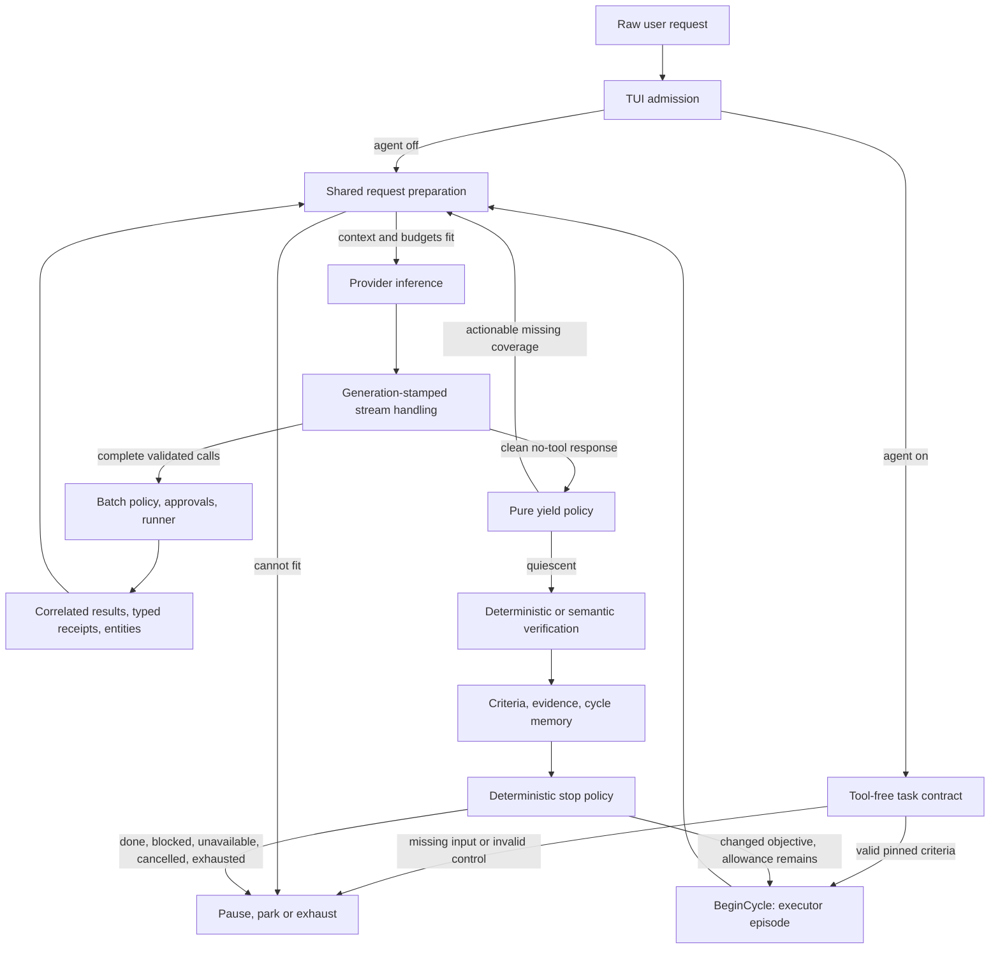

# LLMTUI agent harness hardening audit

Audit date: 2026-10-08. Baseline: `5b6c32ca72f6e59b46ab6ac52dff058a2cc159eb`.
Environment: macOS arm64, Go 1.27.1. Scope: Go executor and harness only;
Apple apps, release infrastructure, runtime pins and production Jira are excluded.
The requested `.claude/tasks/plans/` path is ignored by `.gitignore:11`, so
this report lives in tracked architecture documentation.

## Pre-implementation discrepancy report

The current source already has the single shared orchestration kernel and
same-episode yield recovery described by ADRs 0001, 0002, 0003, 0005 and 0013.
The historic hypothesis of a missing yield gate is obsolete. Ordinary chat
and agent execution share `dispatch`, `continueChat`, `startRequest`,
`handleStreamEvent`, `startToolBatch`, and `sendToolResults`.

Two source-level candidates need failing regression tests before production edits:

1. **P1 candidate: exact-read proof can be overridden by a verifier.**
   `agent/criteria.go:evaluateCriterion` requires full delivered coverage, but
   `agent/run.go:CompleteVerification` applies arbitrary satisfied per-ID
   updates. `tui/agent_loop.go:satisfyLegacyPassedCriteria` also synthesizes an
   update from a single-criterion semantic pass. If yield is disabled or the
   read capability is absent, semantic optimism may convert missing coverage
   into success. Deterministic evidence clamping checks execution errors,
   not required read coverage. Reproduce with a 1,500-line fixture, a first-page
   read, a premature answer, and an optimistic verifier.
2. **P2 candidate: episode request ceilings are enforced after retries.**
   `tui/pipeline.go:startRequest` retries transport errors and resends rejected
   tool schemas without consulting the remaining episode allowance.
   `tui/agent_yield.go:noteAgentEpisodeRetries` charges them on a successful
   first-stream message, after the calls occurred. Terminal pre-stream errors
   carry no attempt count. Reproduce with a one-request allowance and a fake
   provider that rejects tools or returns transient transport errors.

No production code changed when this discrepancy report was written.

## Baseline

`go test -count=1 ./...` passed on the unmodified baseline with localhost
listeners permitted. The initial sandbox run failed to bind `httptest`
listeners in decision, selfupdate and TUI tests; that is environment failure,
not a product defect. Native inference and real Laya evaluation are opt-in
and are not established by this result.

## Next steps

Trace owners and triggers end to end; independently review current OMP source
and provider/tool/MCP boundaries. Add deterministic regressions, record their
baseline failures, and fix only confirmed failures in the existing owners.
Extend the existing eval fixtures where an independent oracle is missing.
Keep prompts and inference settings unchanged without live A/B evidence.
Run focused tests, full Go tests, vet, the required race subset and `make check`.
Record limitations, source comparisons, results and rollback here.

## Current execution architecture and ownership

References below are repository-relative paths and exact symbols. The audit
follows the code at the baseline SHA; candidate-only behavior is called out.



| Transition | Owner, actual trigger and important boundary |
| --- | --- |
| 1. Admission | `internal/tui/app.go:send` and `agent_loop.go:startVerifiedRun`. `/agent on` wraps the same chat kernel; it does not enable tools. A new run captures the immutable request, bounded start context and run deadline. |
| 2. Contract creation | `agent_loop.go:startAgentContract` → `internal/agentverify/contract.go:EstablishContract`. One bounded fresh, tool-free request; malformed control gets one repair, structured-output rejection falls back within admission limits. |
| 3. Acceptance criteria | `handleAgentContract` → `internal/agent/run.go:CompleteContractWithAssessments`, `criteria.go:PinTypedCriteriaWithAssessments`. Controller assigns stable IDs and pins once before `BeginCycle`; missing user input delegates to offered `ask_user` or pauses. |
| 4. Prompt | `pipeline.go:compositionBase`, `prepareRequest`, `prepareFromBase` → `internal/prompt/compose.go`. Optional retrieval, summary, entity and agent sections stay separate; the raw message stays verbatim. Fixed overhead, schemas and reserve are estimated before dispatch. |
| 5. Provider request | `buildRequestWithTools`, `dispatch`, `continueChat`, `startRequest`. Capabilities and profiles select format/settings; run and episode allowances are controller-owned. Native continuations bypass response cache. |
| 6. Model decision | The configured provider/model emits reasoning, text or tool calls. Reasoning is ephemeral activity, not acceptance evidence. The model chooses actions; the controller never fabricates an action from a prose claim. |
| 7. Decode/validate | OpenAI `openai.go:wholeResponse`, `stream.go:streamResponse`; Ollama `ollama.go:streamResponse`; embedded `embedded.go:generate`. TUI accepts only the active generation. `tools.EnsureToolCallIDs` runs before transcript storage; `CallsFromNative` or the complete fenced protocol produces `tools.Call`; malformed arguments remain `InputErr` and fail before execution. |
| 8. Execution | `app.go:startToolBatch`, `startPlannedToolBatch`, `runToolPlan`; `internal/tools/tools.go:Runner.ExecuteContext`; MCP calls through `tui/mcp_tools.go:executeMCPCall`. Progress, capability visibility, limits, approval and confined path resolution stay authoritative. `Update` schedules `tea.Cmd`, never synchronous long work. |
| 9. Feedback | Batch result handlers budget delivered results before accounting; `recordAgentToolResultsCount` records action status independently of producer outcome. `sendToolResults` appends matching native `role:tool` IDs or framed fenced results, then reuses the kernel. Results are evidence of execution, not universal task-success proof. |
| 10. Continue/yield | Tool results trigger `continueChat`; clean no-tool events reach `agent_yield.go:handleAgentYield` and `agent/yield.go:EvaluateYield`. Only recognized, actionable exact-read obligations justify mechanical continuation. Coverage high-water, request and nudge caps prevent unbounded re-inference. Semantic ambiguity goes to the existing verifier. |
| 11. Verify | `startAgentVerification` first prunes recovered derived errors and applies deterministic read criteria. `agent_decision_policy.go:planAgentVerification` selects the existing route. `agentverify.Verify` sees fresh bounded receipts/facts/observation views without tools or ordinary history; deterministic failure clamps model verdicts. Verifier failure retries verification only, then records `verification_unavailable`. |
| 12. Memory/evidence | `agent/run.go:CompleteVerification`, `WriteMemory`; controller evidence/criteria and concise cycle memory remain authoritative. Entity observations retain provenance/version/coverage; compacted prompt summaries cannot reconstruct or authorize runtime state. Durable project promotion requires the existing semantic-verification path. |
| 13. Stop/retry | `agent.Decide`, `ApplyStop`, TUI `handleAgentVerification`. A fresh cycle requires a bounded changed objective/progress, preserves run totals, and cannot reset the run deadline. Cancellation uses generation invalidation; interrupted executor streams get one bounded replay before tools execute. Terminal pre-stream failure is not replayed again. |

`internal/toolapi/server.go` mirrors the catalog read-only; it is not an
alternate tool-execution route. `mcp/registry.go` owns explicit connect,
discovery, stale-connect generations, invocation and shutdown; declarations
start nothing. Laya reaches the orchestration only through
`tui/agent_observer.go`; shadow data and the shipped empty assist calibration
profiles cannot authorize tools, satisfy criteria or replace verification.

### Documentation discrepancies

- The historical missing-yield-gate hypothesis is no longer current.
- Before this patch, the documented per-episode provider-attempt ceiling was
  only strict between admitted requests, not inside retry/fallback.
- The exact-read parser's comment promised atomic criteria but its old test
  explicitly accepted `Read report.md and report its heading` as a filename.
  That made a semantic task spuriously eligible for read recovery. The
  candidate recognizes only an unambiguous atomic natural-language target;
  quoted paths with spaces and explicit `read_file:` shorthand remain valid.
- `internal/agent/yield.go` still contains phase-era comments saying wiring
  has no caller. Actual call sites are in `app.go` and vision completion.
  This audit does not treat those comments as runtime evidence.

## Confirmed findings, reproductions and implementation

No P0 defect was established by this scoped audit. This is not a claim that
the entire application is free of security vulnerabilities.

| ID / priority | Evidence and reproduction | Candidate / status |
| --- | --- | --- |
| H1 / P1: false full-read completion | `agent/run.go:CompleteVerification` accepted satisfied/not-applicable updates without coverage. `TestAgentPartialReadRejectsOptimisticVerifier` delivered only 400/1,500 lines, disabled yield, and returned a semantic PASS; baseline ended `done`. `TestVerificationCannotOverrideRequiredReadCoverage` also reproduced missing, unknown-total, gapped and mixed-version overrides. | Fixed at the existing state-machine commit boundary by `criteria.go:constrainRequiredReadVerification`. Unresolved exact reads cannot be newly satisfied or waived without delivered coverage. An optimistic PASS becomes inconclusive; unrelated semantic updates survive. Previously established criterion proofs retain their cycle ownership. Empty and completely delivered files remain valid. |
| H2 / P2: attempt ceiling overflow and missing failed-attempt accounting | `TestAgentEpisodeCeilingBoundsPreStreamAttempts` observed two actual executor calls at limit one, for both transient failure and native fallback. `TestAgentTerminalPreStreamFailureAccountsEveryAttempt` observed three failed calls but a checkpoint count of one. | Fixed in `pipeline.go:startRequest`: capture the remaining allowance on the UI goroutine and check before every send. Terminal failures return through generation-stamped `firstStreamMsg` for accounting, with `requestFailed` preventing another replay. Count a fallback only when it actually dispatches. No final backoff when another attempt cannot run. Ordinary chat and yield-disabled runs retain their retry allowance. |
| H3 / P1: read-only constraint interpreted as a write request | `agent/proof.go:MissingFileWriteReceipt` matched `modify` inside `Do not modify files`. New negation unit cases failed; the full-read matrix read every line yet entered a spurious write-recovery cycle and failed after its script exhausted. | Fixed with a bounded immediate-negation check for `not`, `never`, `without`, `don't` and `dont`. A separate affirmative write in the same request still requires a real successful write receipt. The same rule prevents an unnecessary contract-coverage escalation. This is a lexical correction, not a general intent parser or a permission change. |
| H4 / P2: cancelled MCP calls still transmitted | Before the patch, a cancelled `StdioClient.call` registered and synchronously wrote `tools/call` before selecting cancellation. Independent temporary overlay reproduced transmission. | Fixed in `mcp/stdio.go`: check cancellation before registration and again after encoding/writer acquisition; propagate the handshake notification's context. `TestStdioCancelledCallNeverTransmits` and `TestStdioCancellationDuringEncodingNeverTransmits` use fake writers and no production integration. |
| H5 / P2: blocked MCP stdin write ignores cancellation | Independent overlay with a blocking fake `Write` measured that context cancellation does not return until the writer is released. Current `write` holds `writeMu` and synchronously calls `Write`; a caller waiting behind it cannot promptly cancel either. | **Open.** H4 prevents cancelled requests from being admitted, but does not interrupt a write already in flight. A robust repair needs bounded cancellable writer ownership plus an interruptible transport. Closing a connection to interrupt a write affects concurrent RPCs and uncertain side effects; this is not a safe incidental change to the production stdio lifecycle. |

Reproduce the controller fixes with:

```sh
go test -count=1 ./internal/agent -run 'TestVerificationCannotOverrideRequiredReadCoverage|TestMissingFileWriteReceipt|TestRequestNamesUnaddressedMutation'
go test -count=1 ./internal/tui -run 'TestAgentPartialReadRejectsOptimisticVerifier|TestAgentRequiredReadCannotPassWithoutTools|TestAgentEpisodeCeilingBoundsPreStreamAttempts|TestAgentTerminalPreStreamFailureAccountsEveryAttempt|TestOrdinaryChatPreStreamRecoveryPreserved|TestAgentHarnessFullReadMatrix'
go test -race -count=1 ./internal/mcp -run 'TestStdioCancelledCallNeverTransmits|TestStdioCancellationDuringEncodingNeverTransmits'
```

### Unconfirmed limitations and hypotheses

- Output fitting: context preparation uses `Context.ReserveResponseTokens`,
  while outbound generation uses `Chat.MaxTokens`; both production defaults
  are 4096, but differing custom settings are permitted. Embedded inference
  has its own fitting behavior. Whether a configured HTTP backend rejects,
  caps or truncates a mismatched request requires an endpoint reproduction.
  No global output-cap change is included.
- MCP omitted non-text parts are acknowledged in visible output, but the
  typed metadata may still report complete capture. Establish whether the
  intended source is the text projection or the full server result before
  changing evidence semantics.
- A protocol-violating duplicate MCP response can potentially block the
  response-channel send. This was inspected statically, not independently
  reproduced; do not report it as measured packet loss or a live failure.
- Lexically lowercased read identities and free-form shorthand targets are
  existing limitations. Case-sensitive filesystem collisions and ambiguous
  plural shorthand need platform/fixture tests before another identity change.
- Denied/unavailable reads are bounded by existing policy; the yield adapter
  checks tool availability rather than pre-resolving paths or acquiring
  permissions. It must not create a parallel filesystem/approval authority.

## Tool protocol, error handling and state integrity

OpenAI streaming accumulates indexed argument fragments and distinguishes
explicit terminal markers from EOF interruption. Ollama normalizes its tool
objects despite absent call IDs; embedded generation parses its selected
native protocol and reports malformed/truncated outcomes. Native IDs are
reserved/deduplicated before assistant history is stored. Complete native and
fenced calls use the same runner; truncation blocks both. Diagnostic Harmony
or other visible pseudo-envelopes can request one normal schema-bound retry,
but are never converted directly into executable calls.

| Failure class | Existing behavior / authority |
| --- | --- |
| Invalid arguments / unexpected type | `CallsFromNative` retains an invalid call as `InputErr`; `Runner.ExecuteContext` returns `invalid_arguments`/`correct_input`, never executes it. Correlated feedback lets the executor correct the call inside its existing episode. |
| Unknown/unavailable tool | Runner/capability boundary returns an error or typed blocked result; MCP visibility/disclosure remains explicit. A hidden MCP-tool diagnostic can trigger bounded discovery recovery, never permission. |
| Parser/malformed output | Existing one-shot malformed-call or visible-envelope recovery uses normal decoding, validation and approval. Exhaustion is failure, not fabricated success. |
| Temporary transport / stream failure | Pre-stream retry uses the configured policy and now the episode cap; an interrupted active agent stream or native chat continuation gets one replay only when no accepted tool side effect occurred in that generation. |
| Tool execution failure | Typed outcome/error/retry hint and controller action status become receipts; derived errors recovered later in the same cycle are pruned, while original failed call records remain. Unknown effect is not proof that no side effect happened. |
| Permission denial | Approval UI owns the answer; denied calls receive paired results and user-input/blockage policy. No controller or verifier manufactures consent. |
| Missing input | `ask_user` pauses execution and retains causal answer-before-mutation ordering; no offered ask capability means an honest contract/user-input pause. |
| Resource unavailable | `not_found`, stale source and unavailable retained bodies remain distinct observations; corrected calls use the same bounded kernel. MCP reconnect is explicit. |
| Context exhaustion / truncation | Preparation compacts whole call/result groups and retains the latest user anchor; irreducible overhead fails before provider dispatch. Delivered-result bounding rewrites read windows to the actual retained lines. Truncated calls do not execute. |
| No useful progress | Canonical validated call/result fingerprints distinguish repeats from fresh evidence; coverage high-water resets read nudges only for relevant advancement. Repeated identical calls are blocked or terminate honestly. |

The observation cache, transient entities, cycle memory, request history
projection and heuristic summary have different owners and purposes. They
are not competing planners. Retained evidence carries tool/source/version
identity; summarized text is framed as untrusted reference data. No summary
can satisfy a criterion or renew budgets. Compaction preserves protocol
groups, counts full schema overhead, and does not run in the middle of an
approval or executing batch. Cancellation retains completed mutation receipts
and marks unstarted siblings as not executed; continuation must not replay a
completed destructive action.

## Current OMP comparison

Reference source inspected at commit
[`c50daa5296d0ae7921560b8bca6091cf01d3481b`](https://github.com/can1357/oh-my-pi/tree/c50daa5296d0ae7921560b8bca6091cf01d3481b).
The reference checkout was read-only; no OMP code was copied and no OMP/local
model speed benchmark was run. Paths below are inside `packages/agent/src/`
unless noted. Its MIT license was inspected; any future code reuse would
require the applicable attribution.

| Area | OMP mechanism | LLMTUI assessment / decision |
| --- | --- | --- |
| Orchestration | `agent-loop.ts:1914` prepares provider context at one boundary; tool-bearing turns repeat inference (`:1587`). Steering/asides/follow-ups are drained before exit (`:1788`). | Existing shared kernel is already appropriate. Retain it. OMP core loop exit is not proof that acceptance criteria are satisfied; reject replacing LLMTUI verification with its exit condition. |
| Arguments/recovery | `tool-arguments.ts:21` supports explicit leniency but preserves parser-error rejection; pause and DSML nudges are bounded (`agent-loop.ts:1700`). | Keep validated normal recovery. Reject broad leniency for writes or external tools. Fix measured admission/accounting errors in the controller, not through more formatting prose. |
| Context reuse | `append-only-context.ts:132` detects prompt/tool identity changes, caches prefix (`:323`) and retains unchanged history prefix on rewrite (`:347`). | LLMTUI freezes system/context prefixes and abandons a frozen variant if it costs more history (`pipeline.go:1137`). Adapt diagnostics/invalidation tests; reject a second context manager. |
| Tool-result feedback | `tool-context.ts:31` deduplicates context and inserts role `developer` (`:48`); `agent-loop.ts:1665` pairs non-executed calls with synthetic results. | Retain bounded framed references and controller-owned non-execution receipts. Reject promoting external tool text into privileged instructions. |
| Completion | OMP loop tests runnable calls and queued work, with bounded provider-pause handling. | LLMTUI additionally has criteria/yield/verification. H1 closes a real authority gap; no imitation loop is needed. |
| Output budget | `output-budget.ts:70` fits actual outbound max output to window minus counted prompt/headway; shared settings wrapper calls it (`packages/coding-agent/src/session/settings-stream-fn.ts:139`). | Potentially adapt at the existing preparation boundary after a backend fixture proves a reserve/output mismatch. Do not copy the 1024-token minimum, which can exceed remaining room, or assume tokenizer parity. |
| Pruning | `compaction/pruning.ts:244` uses supersession; failed results do not erase successful prior evidence. | Consider typed version/coverage-aware pruning only after measuring duplicate context. Path-only replacement would lose ranged-read proof. |
| Prompt/summary | OMP structured compaction handoff preserves goals, constraints, progress, decisions and next steps; historical text is untrusted. | Current deterministic summary already preserves receipt groups, paths/errors and suggestion-vs-outcome distinctions. An optional semantic summary needs independent evidence/latency evaluation before adoption. |
| Efficiency/scheduling | `agent-loop.ts:3765` distinguishes shared and exclusive tool work, defaulting unspecified tools to shared. | Measure serial tool time first; only explicitly independent reads could qualify. Reject copying default shared execution across LLMTUI mutations, approvals and its serialized runner. |

These are engineering differences, not evidence that OMP completes more tasks
with the same local model, quantization, settings and workspace.

## Local-model instruction assessment

Actual instruction owners were inspected: `prompt/compose.go`,
`tools/tools.go:NativeInstructions` and fenced instructions,
`tui/agent_loop.go:agentDirective`, `agent_yield.go:buildAgentYieldDirective`,
`agentverify/contract.go`, `agentverify/verifier.go`,
`tui/tool_recovery.go`, and `modelprofile/profile.go`.

- Ordinary chat gets the user's core/template plus selected helpers and
  available tool protocol. Agent execution additionally gets bounded criteria,
  objective, receipts, pending read windows and controller state. It does not
  have a second competing planner or require printed private reasoning.
- Native tool continuations keep a frozen system prefix, current receipts in
  history and changing runtime sections after history. Yield continuations
  suppress rejected premature executor prose from the executor projection,
  retain it for visible/verification history, and recompute coverage hints.
- Contracting and semantic verification use separate tool-free prompts for
  separate jobs. Their extra request cost is real; it must not be confused
  with execution retries. Task-contract coverage protects explicit deliverables,
  while semantic assertions are not permission grants.
- Recovery feedback is narrowly scoped and single-request. Schema-guided
  correction is preferable to more global instructions. H1/H2/H3 could not
  be solved reliably by telling the model to “continue” more often.
- Family profile hints influence defaults but concrete provider/model
  capabilities control protocol and structured-output behavior. No new
  Gemma/GPT-OSS/Qwen name-only assumptions or sampling defaults were added.
- Potential cost: frozen first-turn runtime state can be stale, but its fresh
  labeled continuation data follows; output duplication is addressed by
  history-aware evidence omission. Existing byte-prefix tests/trace support
  correctness, not a new live prefill-speed claim.

An opt-in A/B candidate for the existing agent instruction slot, **not applied
globally or claimed effective**, is:

```text
Follow the requested objective and constraints.
Choose the next useful action from the offered tools and match its schema.
Use the returned result; a requested action is not proof of execution.
Continue while required work remains and a permitted useful action exists.
Check observable evidence before claiming completion.
Finish concisely when complete, or state what is genuinely blocked.
```

Compare it against the unchanged baseline instructions using the same live
fixtures, provider protocol, reasoning/template, quantization, seed/sampling,
context/output limits, warm/cold state and trials. Reject it if false success,
invalid arguments, approval behavior or completion rate regresses. Do not
infer an instruction improvement from string-preservation unit tests. The
current task's production prompts remain unchanged.

## Benchmark methodology and comparison

The existing `internal/eval` report and TUI controller driver are reused.
The candidate adds two live fixtures: full 1,500-line delivery with an exact
last-line answer, and approved creation followed by `cat result.txt` plus an
independent filesystem oracle. The full-read oracle checks every synthetic
line in actually delivered native/fenced tool text, not the controller's
coverage predicate or the verifier's confidence. Existing creation oracle
checks exact bytes, path, ordering and duplicate effects.

The measurements were taken from a working-tree patch on the baseline SHA.
The unchanged implementation and fixtures are now recorded through candidate
commit `c24cbf449d60a2a24382a7aea6ea9a6f6ba900b9` (the three focused code
commits); the following documentation commit records this report. No release
was created. Final fixture SHA-256 fingerprints:

- `internal/tui/agent_harness_hardening_test.go`:
  `85f2f5b878ab5d84ec8aedc907399cf2b05043cfc0a74633b1c86eccaa1262e3`
- `internal/tui/live_agent_eval_test.go`:
  `5ff544a3b2a181e5f4b047602adb6ec623eff80621ad8741aef18578db9184a9`
- `internal/agent/read_verification_test.go`:
  `e631a830280d47db131f3ca4dcfef12090bfcb1f0391615826bad0da568cb6ce`

The live driver previously advertised output cap 4096 in report metadata but
inherited the synthetic test model's 128-token executor cap and 512-token
reserve. It now applies the advertised 4096 cap/reserve and production yield
defaults explicitly. The new large-file workload gets 100,000 run tokens and
16 tool calls; small cases retain 20,000/8. This is test-harness configuration,
not a production model setting change. Baseline/candidate comparisons must
use the same updated fixture driver on both revisions.

| Requested scenario | Evidence / coverage |
| --- | --- |
| A: beyond first 400 lines | New `TestAgentHarnessFullReadMatrix`, 5 trials, four real paginated reads across 1,500 lines with premature replies between reads. Existing audit trace also reads the exact last line. Live full-read fixture added. |
| B: tool-error recovery | Existing `TestAgentAuditTrace` malformed ranged read (`offset:"end"`, then after EOF, then valid); malformed native/fenced tests. New pre-stream attempt tests cover transport and fallback. |
| C: workspace mutation/check | Existing trace edit/readback and live `confirm_write`; new `write_and_check` uses the independent file oracle plus successful check receipt. |
| D: retained evidence | Existing trace follow-up asserts prior evidence is available and makes no additional read; evidence deduplication/frozen-prefix tests. |
| E: premature completion | New optimistic partial-read regression plus pure missing/gap/version cases; existing missing-write-receipt tests. |
| F: no progress | Existing `TestAgentYieldStopsDeterministicallyWithoutProgress`, repeated web-loop/progress tests and coverage high-water tests. |
| G: approvals/cancellation | Existing ask/approval paths, `tool_batch_cancel_test.go`, audit cancellation after completed mutation and new MCP cancellation admission tests. |
| H: MCP lifecycle | Disposable helper subprocess in `TestStdioHandshakeListAndCall`, close/stale-connect/oversized-frame tests. No jiraWorklog or production Jira was contacted. |
| I: resource limits | Existing prospective token/run/tool budgets, episode ceilings, schema disclosure fit, delivered-result truncation and context pair/anchor tests. New retry/fallback ceiling tests. |

An archived baseline source tree in `/tmp` was run with the same new test
fixtures and unchanged baseline production code. The original existing trace
was also run on both revisions, including ordinary chat and simulated embedded
configuration. These are scripted providers; they do not run native inference.

| Measurement | Baseline | Candidate | Meaning |
| --- | --- | --- | --- |
| Partial 400/1,500 read + optimistic verifier | `done`, false success | Not `done`; criterion unresolved | Confirmed completion-integrity fix, not a model-quality estimate |
| Missing/partial/unknown/gap/mixed-version criterion overrides | 10 negative subcases falsely accepted | All 10 rejected; 4 complete/empty positive subcases still pass | Prevents both satisfied and not-applicable bypasses |
| One-attempt episode, transport/fallback | 2 executor attempts in each case | 1 in each case; `budget_exhausted` | Actual provider invocations independently counted |
| Failed fallback + transient + fatal request accounting | 3 executor calls, checkpoint 1 | 3 executor calls, checkpoint 3 | No extra replay, honest attempt accounting |
| Read all 1,500 lines with `Do not modify files`, 5 trials | 0/5 correct terminal completions despite successful delivery; spurious write recovery | 5/5 completed; 0/5 false success; 10 provider requests, 4 executed reads, 1 cycle each | H3 removes an incorrect blocker; four executor yields remain scripted, not model decisions |
| Existing successful audit trace | 32 combinations pass | 32 combinations pass; request/stage counts unchanged | Regression evidence for ordinary chat, context reuse and shared kernel |
| Cancellation of already-completed mutation | File/receipt retained; no unanswered tool IDs | Same | No duplicate side-effect replay introduced |
| Live model completion, tokens, latency, variance | Not measured | Not measured | No endpoint/model was explicitly configured |

The scripted provider emits 10 prompt + 5 completion tokens per successful
request. The full-read candidate's 150 tokens are therefore **fake accounting
values**, not actual prompt tokenization or local inference consumption. Its
millisecond elapsed time measures test-driver/filesystem overhead only and
cannot substantiate an inference-speed improvement. Request counts have no
variance across the five scripted trials; live variance remains unknown.

### Measurement gaps and live procedure

Existing reports capture completion/postcondition failure/false success,
native-tool conformance, invalid arguments/correlation, recovery, provider
requests, usage totals and end-to-end elapsed time. Tool counts and repeated
effects are recorded separately. Additional precision still needs measured
driver instrumentation: inference/tool/verification time partition, redundant
read counts versus permitted fresh reads, and per-trial compaction frequency.
Do not encode missing measurements as zero or report an unavailable live rate
as 100%. Budget exhaustion is visible as a terminal result, not an inferred
model failure.

Run the existing opt-in matrix with `LLMTUI_EVAL_BASE_URL` and
`LLMTUI_EVAL_MODEL`, pin `LLMTUI_EVAL_ENDPOINT_TYPE`, record the baseline and
candidate SHAs/fixture hash in existing report metadata, and use at least five
trials per scenario. Run baseline and candidate alternately with identical
updated fixture code/settings; report all trials and distributions. Reports
must contain only the existing content-safe aggregate fields, never real user
prompts, credentials, reasoning or tool payloads. A claim of task success
requires the independent fixture oracle, even if the verifier says PASS.

## Incremental implementation, risk and rollback

1. **Completed:** write pre-edit discrepancies, run baseline, reproduce H1/H2.
2. **Completed:** clamp exact-read criterion updates at `CompleteVerification`;
   narrow atomic grammar, preserve semantic updates and persisted structures.
3. **Completed:** enforce retry/fallback attempt admission and account terminal
   failures; preserve native IDs, existing errors and ordinary chat recovery.
4. **Completed:** correct direct negative write intent; keep affirmative-write
   receipt enforcement. Fix cancelled MCP admission with fake-only tests.
5. **Completed:** extend existing eval fixtures/oracles and correct advertised
   test settings; compare the same fixtures and existing trace on both sources.
6. **Next, separate transport change:** address H5 with cancellable writer
   ownership, pipe interruption, simultaneous calls, shutdown and unknown-effect
   tests. An uncertain external mutation must never be blindly replayed.
7. **Next, only with live evidence:** evaluate actual output fitting, compact
   instruction variant, and coverage-aware pruning. No new planner/verifier
   framework or mandatory Laya/Python runtime is justified by this audit.

Risk: exact-read runs that previously relied on optimistic/off/deterministic
passes now remain incomplete until required coverage exists. This is deliberate
and applies across verifier modes; semantic combined tasks keep their existing
owner. Direct negation is intentionally narrow and does not understand every
language or paraphrase. Retry failure delivery now uses the first-event adapter;
generation, cancellation and ordinary-chat regressions cover that shared path.
MCP admission checks cannot retract a write that starts immediately after the
check, nor interrupt an already-blocked write.

Rollback is file-scoped: revert H1 in agent criteria/run code, H2 in the TUI
request/first-event adapter, H3 in `agent/proof.go`, or H4 in MCP stdio along
with the matching regressions/docs. No configuration migration, public API,
dependency or persisted-run schema was added. Turning yield off is **not** a
rollback of the exact-read completion guard. Any future prompt experiment must
be separately reversible. Revert an experiment on false success, unsafe
execution, approval regression or unexplained material performance loss.

## Verification record

Initial baseline full suite: passed with permitted localhost test listeners.
New regressions: observed failing on baseline before fixes. Candidate focused
matrix and five full-read trials: passed. Full candidate `go test -count=1
./...` and `go vet ./...`: passed. Required race subset and `make check`
(including full `go test -race ./...` and installed lint reporting zero issues):
passed. After final test-harness adjustments, the full TUI package (including
its race tests) and focused
all-verifier-mode/full-read regressions passed again. Go CLI build to a
disposable `/tmp` binary passed. `govulncheck` found zero reachable symbol or
imported-package vulnerabilities; it reported one non-reachable required-module
advisory, so this is not a claim of zero module advisories. Formatting and
`git diff --check` passed. The live evaluation tests explicitly
skipped because endpoint/model variables were absent; real embedded inference
and Laya model inference remain untested, even where their package unit tests
pass. No Apple app, release, pin, vendored dependency or production Jira file
was changed. At audit completion nothing had been pushed, merged or released.
The subsequent user request authorizes focused commits and publication of a
pull request; it does not authorize merging or releasing. The pre-commit
`make check` was rerun successfully before creating those commits.
