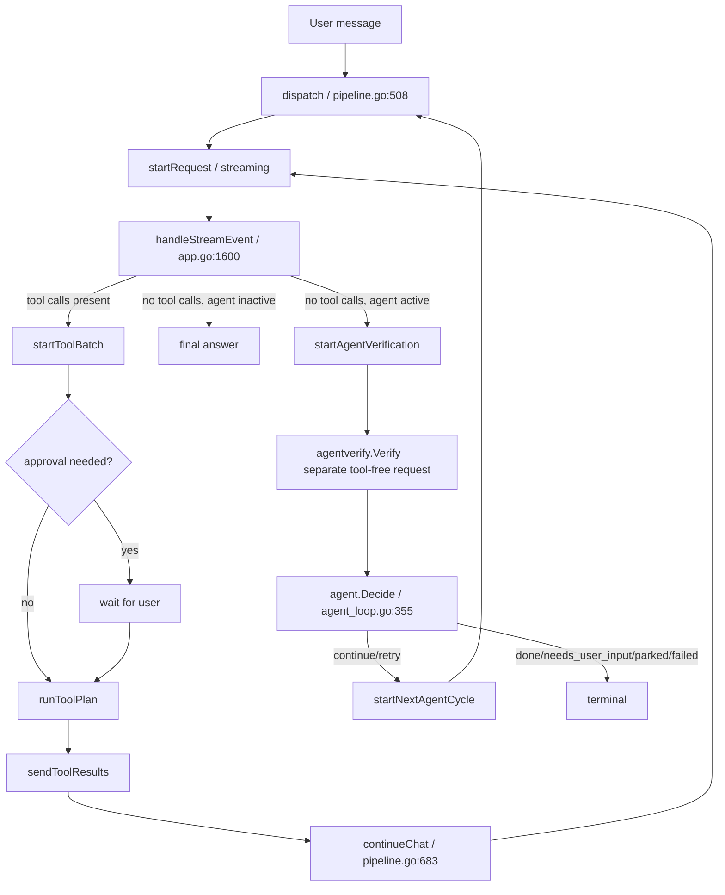

# v1 Architecture Audit

Status: Phase 1 evidence baseline for the v1.0.0 stabilization release.
Baseline commit: `0458b5f` (branch `feat/v1-agent-runtime`, forked from `master`).
Scope: this document is evidence-first. Every claim below is grounded in a
file:line reference, a test name, or a reproducible command. Where evidence
was insufficient to confirm a hypothesis, it is marked "suspected," not
"confirmed."

## 0. How this document was produced

Two read-only investigations were run in parallel against the repository at
baseline:

1. An architecture/lifecycle trace through `internal/tui/pipeline.go`,
   `internal/tui/app.go`, `internal/tui/agent_loop.go`, `internal/agent`,
   `internal/agentverify`, `internal/provider`, `internal/tools`, and the
   relevant test files.
2. A cross-reference of the repository's existing `security-review/` audit
   (dated 2026-07-19) and four `.claude/tasks/*.md` planning documents
   against `git log`, to establish what prior investigation and remediation
   already happened, so this audit does not duplicate it.

The most consequential claims from both (the single-kernel finding and the
live-budget-enforcement gap) were independently re-verified directly against
source in this session rather than taken on the sub-investigation's word; see
§4.2 for the re-verification.

## 1. Package and responsibility map

| Package | Lines | Responsibility |
| --- | ---: | --- |
| `internal/tui/pipeline.go` | 821 | Request composition: prompt assembly, context-fit loop, cache-key derivation (`cacheKeyFromPrepared`, pipeline.go:418-441), streaming/retry (`dispatch`/`continueChat`/`startRequest`, pipeline.go:508,683,733). Single request-origination point for **all three** lifecycles. |
| `internal/tui/app.go` | 2365 | Bubble Tea `Model`; terminal stream-event dispatch (`handleStreamEvent`, app.go:1600-1707); tool-batch orchestration (`startToolBatch` app.go:1029, `runToolPlan` app.go:1081, `sendToolResults` app.go:1118); approval UI (app.go:1152-1258). |
| `internal/tui/agent_loop.go` | 667 | `/agent on` state glue only. Does not stream a model or execute a tool itself; calls the same `dispatch`/`continueChat` ordinary chat uses. |
| `internal/agent` (`types.go`,`run.go`,`policy.go`,`store.go`) | 1145 | Provider/UI-independent `AgentRun` state machine, hard budgets, `Decide()` stop policy, versioned file-backed run store. |
| `internal/agentverify/verifier.go` | 276 | One bounded, tool-free evaluator request; strict JSON parsing; deterministic-evidence override. |
| `internal/provider` (+ `openai`,`ollama`,`embedded`,`mock`) | — | `Provider` interface, `Capabilities` struct (5 booleans + context window, `capabilities.go:13-20`), truncation normalization (`EventDone{Truncated:...}`). |
| `internal/tools` | 1801 | Native/fenced tool parsing (`native.go`), registry, guardrails, diff/web helpers. `EnsureToolCallIDs` (native.go:110-134) backfills/deduplicates **IDs only**, not call content. |
| `internal/mcp` | 1042 | stdio transport, JSON-RPC framing, per-server registry/trust boundary. |
| `internal/cache/cache.go` | 360 | Single final-response cache keyed by `cache.Key` (provider, base URL, model, message, system prompt, history hash, tools hash, skills hash, runtime fingerprint). |
| `internal/contextmgr/contextmgr.go` | 240 | Window-fit `Decide`/`Split`, heuristic summarizer. |
| `internal/history`, `internal/memory`, `internal/chat/session.go` | — | Saved-session persistence, opt-in preference snippets, single live `chat.Session` (conversation-state owner, `session.go:18-26`). |
| `internal/prompt/compose.go` | 291 | Deterministic section ordering: system → agent directive → template → skills → memory → RAG → history. |

## 2. Request lifecycles (traced through real code)

**(a) Plain chat.** `send()` (app.go:958) → `dispatch()` (pipeline.go:508) →
cache check → `startRequest()` (pipeline.go:733) → `handleStreamEvent`
(app.go:1600) on `EventDone` with no tool calls → done.

**(b) Tool-enabled chat.** Same `dispatch`/`startRequest`/`handleStreamEvent`
path. On `EventDone` with `ToolCalls` present (app.go:1676) or fenced blocks
(`maybeRunTools`, app.go:992) → `startToolBatch` (app.go:1029) → approval
gate or `runToolPlan` (app.go:1081) → `sendToolResults` (app.go:1118) →
`continueChat()` (pipeline.go:683) → back into `startRequest`/
`handleStreamEvent`. Loop bound: `m.toolDepth` vs `toolMaxIter()`
(`tools.max_iterations`, default `10`) — app.go:1038, reset per user turn at
app.go:979.

**(c) `/agent on`.** `startVerifiedRun` (agent_loop.go:132) creates an
`AgentRun`, then calls the **identical** `dispatch()` (agent_loop.go:162).
Every executor turn goes through the same
`handleStreamEvent`/`startToolBatch`/`runToolPlan`/`sendToolResults`/
`continueChat` code as (b). The only agent-specific branch inside that shared
code is app.go:1689-1694: when a turn finally has no tool calls and no
pending approval, it calls `startAgentVerification()` instead of just
ending. Verification runs a separate tool-free request
(`agentverify.Verify`), then `agent.Decide()`/`run.ApplyStop()`
(agent_loop.go:355-356) either starts another cycle via
`startNextAgentCycle` (agent_loop.go:189, itself calling `dispatch` again) or
terminates.



**Shared vs. duplicated logic.** Composition (`prepareRequest`/`compose`),
cache-key derivation, streaming/retry (`startRequest`), tool
dispatch/approval/execution/result-append
(`startToolBatch`→`sendToolResults`→`continueChat`), and the conversation
store (`chat.Session.Messages`) are **one shared implementation** used by all
three lifecycles.

## 3. Decision required by §6.2 of the master prompt: is there more than one orchestration loop?

**No — not for model/tool execution.** This was the master prompt's leading
structural hypothesis and it does not hold. `/agent on` is a thin
state-machine wrapper (`internal/agent` + `agent_loop.go`) that starts,
continues, and verifies cycles *through* the same `dispatch`/`continueChat`
primitives ordinary chat uses. There is one authoritative kernel for model
calls and tool execution already, largely matching the target shape in
master-prompt §6.2.

The duplication that **does** exist is budget/limit tracking:
`tools.max_iterations` (UI-level, per-user-turn-resettable, human-approval
gated) and `agent.max_tool_calls`/`agent.max_tokens` (state-machine-level,
evaluated only at cycle boundary) are two independent, only loosely
coordinated bound mechanisms — see §4.

See [`decisions/0001-single-orchestration-kernel.md`](decisions/0001-single-orchestration-kernel.md).

## 4. Confirmed defects

### 4.1 No tool-call fingerprinting or no-progress detection anywhere

Grep across `internal/agent`, `internal/tools`, `internal/tui/agent_loop.go`,
`internal/agentverify` for `duplicate|repeat|fingerprint|dedup|no_progress`
returns only: (a) ID-collision handling in `EnsureToolCallIDs` (unrelated —
identity, not content), and (b) `AgentRun.RepeatedFailures`/`FailureKey`
(agent/run.go:267-289), which fingerprints **verifier failure outcomes
across cycles**, not tool calls within a cycle.

There is no canonicalization or fingerprint of `(tool, args, resource)`
anywhere in the codebase, in either the ordinary tool loop or `/agent on`
mode, and nothing recognizes "same web_search query" or "same URL fetched
again" as non-progress. This is the direct cause-class the master prompt's
§2 failure report describes, and it is confirmed absent by exhaustive grep,
not merely under-tested.

### 4.2 Agent hard budgets are not enforced live — re-verified directly against source

This is the most consequential confirmed defect and was independently
re-read line-by-line in this session (not taken solely from the
sub-investigation):

- `agent.Decide()` (`internal/agent/policy.go:11`) is the only place
  `run.ToolCalls > MaxToolCalls`, `PromptTokens+CompletionTokens >
  MaxTokens`, and `RepeatedFailures >= MaxRepeatedFailures` are evaluated.
- It is called from exactly one place: `handleAgentVerification`
  (`internal/tui/agent_loop.go:355`).
- `handleAgentVerification` is only reached via `startAgentVerification`,
  which is only called from `app.go:1691`, which is only reached when a
  turn produces **zero tool calls** — confirmed by reading `app.go:1676-1694`
  directly: the `len(msg.event.ToolCalls) > 0` branch (app.go:1676) and the
  `maybeRunTools()` fenced-block branch (app.go:1682) both `return` before
  the verification gate at app.go:1689 can be reached.

**Consequence:** if the executor keeps returning `tool_calls` every turn and
never emits a plain final answer, `Decide()` is never reached, and the
documented hard budgets (`agent.max_tool_calls: 32`, `agent.max_tokens:
100000`) are not enforced during that spree.

Two weaker guards apply instead, and both were re-verified:

1. `agentToolBudgetExceeded` (`internal/tui/agent_loop.go:550-552`):
   ```go
   func (m *Model) agentToolBudgetExceeded(incoming int) bool {
       return m.agentRunActive() && len(m.agentLoop.execution.ToolCalls)+incoming > m.agentLoop.run.Limits.MaxToolCalls
   }
   ```
   `m.agentLoop.execution` is reset to `agent.ExecutionResult{Objective:
   run.Objective}` at the top of **every cycle**
   (`agent_loop.go:182,201` — both `startVerifiedRun`'s first cycle and
   `startNextAgentCycle`). So this check compares a **per-cycle-reset
   counter** against a value the config and docs describe as a **run-level**
   ceiling. A run that reaches its cycle limit (default `max_cycles: 8`)
   without ever tripping this per-cycle check could execute up to
   `8 × 32 = 256` tool calls before `Decide()` ever evaluates the true
   run-level `ToolCalls` total at a cycle boundary.
2. The UI-level `tools.max_iterations` round cap (default `10`,
   app.go:1038) pauses for a human `y/continue` decision (`resolveBudget`,
   app.go:1246) with no cap on how many times "continue" can be granted,
   and resets `toolDepth` to `0` on each grant (app.go:1251).

`run.PromptTokens`/`CompletionTokens` do accumulate live per turn
(`finishStream`, called on every `EventDone`), but nothing consults that
running total against `Limits.MaxTokens` until the cycle-boundary
`Decide()` call. This is the most direct, code-confirmed mechanism by which
a run could burn far past the documented 100k-token ceiling while still
nominally "running" — closely matching the reported ~110,000-token
no-progress scenario in master-prompt §2.

`agent.max_elapsed` is the one budget that **is** enforced live, via
`context.WithTimeout` in `resetAgentContext` (agent_loop.go:208-216).

### 4.3 Documentation/code mismatch: "run-level tool-call limit"

`docs/agent-loop.md` (lines 74-76) states:

> Agent mode adds a total run-level tool-call limit above the existing
> per-turn `tools.max_iterations` limit. Reaching the run limit does not
> display a budget renewal prompt: further calls are rejected and the stop
> check reports `budget_exhausted`.

Per §4.2, this is only true at cycle boundaries. Within a cycle, the
per-round guard resets every cycle, so the "run limit" as actually enforced
live is a **cycle-scoped** ceiling repeated up to `max_cycles` times, not a
true run-level ceiling until `Decide()` runs. The doc should either state
this precisely or the implementation should be changed to match the
documented guarantee (v1 target: implementation changes to match the
documented guarantee — see
[`v1-agent-runtime.md`](v1-agent-runtime.md)).

### 4.4 Dependency vulnerability (supply chain)

`govulncheck ./...` (baseline run, this session): `GO-2026-5970` — infinite
loop on invalid input in `golang.org/x/text@v0.38.0`, fixed in `v0.39.0`.
Reachable via `internal/skill/manager.go:661` (`CatalogText` → `fmt.Fprintf`
→ `norm.Form.Properties`) and `internal/history/usage.go:61`
(`ReadUsage` → `bufio.Scanner.Scan` → `norm.Form.Transform`). Trivial fix: a
dependency bump. Tracked as part of the security-hardening slice, not the
runtime-refactor slices.

### 4.5 Provider capability model is reactive, not declared

`provider.Capabilities` (`capabilities.go:13-20`) has only 5 booleans plus
context window — no native-tool-calling, parallel-tool-call, or reasoning
flags. Native-tool rejection is detected reactively by string-matching a
provider error (`toolsRejectedError`, pipeline.go:794-805) rather than via a
negotiated/declared capability. This is a gap relative to master-prompt
§7.4, not a defect causing the reported failure mode — tracked as its own
slice.

## 5. Suspected (not fully confirmed) issues

- `internal/prompt/compose.go:45-90` frames untrusted RAG/web/MCP content
  with a text preamble, not a hard structural delimiter
  (`START_UNTRUSTED_CONTEXT`/`END_UNTRUSTED_CONTEXT` or equivalent). Flagged
  in the prior security review's `AI_AGENT_GAP_ANALYSIS.md` as a soft/prose
  control; status unchanged at this baseline. Confirmed present as
  soft-control, not confirmed exploitable — needs a concrete prompt-injection
  test to move from suspected to confirmed/refuted.
- `internal/rag/*.go` has no content-based secret scanner (only
  filename-based `IsSecretPath` reuse — `internal/rag/rag_test.go:81` only
  exercises the filename case). Explicitly flagged as an optional/stretch
  item in the prior `fix-security-and-correctness-bugs.md` plan (Phase 11,
  item 1) and never implemented. Low severity: requires a user to
  deliberately index a secret-containing file into local RAG.
- `internal/tools/approval_policy.go` (`7d8fa97`) added *temporary* scoped
  capability grants; whether it reaches the full per-tool/per-path-glob
  granularity envisioned by the prior remediation plan's item 16 was not
  independently re-read in this session (deferred; low priority, does not
  block v1 gates).

## 6. Strengths confirmed and to be preserved

- Stale-async-event rejection is present and consistent across all three
  lifecycles: `msg.gen != m.streamGen` (app.go:1601), `msg.gen !=
  m.mcpBatchGen` (app.go:796), and the verify-message triple check
  `runID/cycle/gen` (agent_loop.go:325-327). Tests exist:
  `TestStaleStreamEventIsDropped`, `TestMCPStaleResultsDroppedAfterPlainEsc`.
- Tool-call ID correlation is solid: `EnsureToolCallIDs` (native.go:110)
  backfills/deduplicates IDs before storage; covered by
  `TestEnsureToolCallIDsRewritesDuplicates` and
  `TestToolCallIDsBackfilledConsistently`.
- Cache-key composition (pipeline.go:418-441) is thorough — provider, base
  URL, model, message, composed system prompt, full history fingerprint,
  tools fingerprint, skills fingerprint, runtime fingerprint — and matches
  `docs/cache.md`'s claims. Agent cycles correctly bypass this cache
  (`m.bypassCache = true`, agent_loop.go:160,184,203), matching
  `docs/agent-loop.md`'s documented behavior.
- The prior security review (baseline `ed2ea82`, 2026-07-19) closed all 19
  tracked findings (10 security, 9 bug/reliability) with a traceable
  commit-per-finding remediation sequence, independently spot-checked in
  this session (`toolDepth = 0` present in `retryLast()`, `HistoryHash`
  wired into `cache.Key`). See
  [`v1-security-review.md`](v1-security-review.md) for the full carry-forward
  status.
- Truncation handling (`c5766af`, `521cd40`, `62994e6`, `ee28be2`,
  `0458b5f`) correctly normalizes `finish_reason`/`done_reason: length`
  across OpenAI-compatible and Ollama providers into a deterministic
  `ChatEvent.Truncated` signal and treats it as non-success evidence inside
  `/agent on`. Note: this signal is not yet consulted by the **ordinary**
  (non-agent) tool-continuation path — see
  [`v1-agent-runtime.md`](v1-agent-runtime.md) §Progress ledger.
- No existing tests fail, no data races, no lint findings, no vet findings
  at baseline (§7 below). This is an unusually clean starting point for a
  major refactor.

## 7. Baseline check results

Recorded at branch point `0458b5f`, Go `1.26.5`, `darwin/arm64`:

| Check | Result |
| --- | --- |
| `go build ./...` | clean |
| `go vet ./...` | clean, 0 findings |
| `go test ./...` | all packages pass, 0 failures |
| `go test -race ./...` | all packages pass, 0 races |
| `golangci-lint run` | 0 issues |
| `govulncheck ./...` | 1 finding: `GO-2026-5970` (see §4.4) |

## 8. Test coverage gap for the reported failure mode

`internal/tui/toolloop_test.go` (~35 tests: iteration cap, approval, budget
renewal prompt, cache-key/tool-state coupling, stale-event dropping, MCP
batch cancellation) has **no test exercising identical repeated tool calls
or a no-progress/duplicate-detection outcome**. `internal/agent/run_test.go`
and `internal/agentverify/verifier_test.go` cover cycle/budget/repeated
*verifier-failure* transitions thoroughly but likewise contain no test for
repeated identical tool calls within a cycle. Building this regression
fixture is the next step before any implementation change (master-prompt
§9.2), tracked in [`v1-test-matrix.md`](v1-test-matrix.md).

## 9. Prioritized risk list

| # | Risk | Confidence | Impacted lifecycle | Doc |
| --- | --- | --- | --- | --- |
| 1 | No tool-call-level repeated-call/no-progress detection anywhere | Confirmed | (b), (c) | [v1-agent-runtime.md](v1-agent-runtime.md) |
| 2 | Agent hard budgets (`max_tool_calls`, `max_tokens`) not enforced live, only at cycle boundary; per-round guard resets every cycle | Confirmed | (c) | [v1-agent-runtime.md](v1-agent-runtime.md) |
| 3 | `tools.max_iterations` renewal has no total cap in ordinary tool mode | Confirmed | (b) | [v1-agent-runtime.md](v1-agent-runtime.md) |
| 4 | `docs/agent-loop.md` overstates the run-level tool-call limit as always-enforced | Confirmed | (c) | this doc §4.3 |
| 5 | `x/text` DoS vulnerability (GO-2026-5970) | Confirmed | all | [v1-security-review.md](v1-security-review.md) |
| 6 | Provider capability model is reactive/string-matched, not declared | Confirmed gap, not a defect | (b), (c) | [v1-provider-capabilities.md](v1-provider-capabilities.md) |
| 7 | Untrusted content framing is prose, not a structural delimiter | Suspected | (b), (c) | [v1-security-review.md](v1-security-review.md) |
| 8 | RAG has no content-based secret scanner | Suspected, low severity | RAG | [v1-security-review.md](v1-security-review.md) |

## 10. Keep / refactor / remove decisions

- **Keep**: the single shared orchestration kernel (`dispatch`/
  `continueChat`/`startRequest`/`handleStreamEvent`/`startToolBatch`/
  `sendToolResults`). It already matches the master prompt's target shape
  for the model/tool loop. No rewrite required here.
- **Keep**: stale-event rejection, tool-call ID correlation, cache-key
  composition, truncation normalization. All confirmed correct.
- **Refactor**: budget/limit enforcement. Move `agent.Decide()`'s
  hard-budget checks (tool calls, tokens) to run live inside
  `startToolBatch`/`runToolPlan`, not only at the cycle-boundary
  verification gate. Introduce a run-level (not cycle-reset) counter for
  `agentToolBudgetExceeded`, or replace it with a call into the same live
  check the state machine uses.
- **Add**: a tool-call fingerprinting/progress ledger, applied to **both**
  the ordinary tool loop and `/agent on` mode, per master-prompt §7.2. This
  is new functionality, not a refactor — no equivalent exists today.
  Design in [`v1-agent-runtime.md`](v1-agent-runtime.md).
- **Remove**: nothing at the orchestration-kernel level. No dead/duplicate
  execution path was found to remove.
