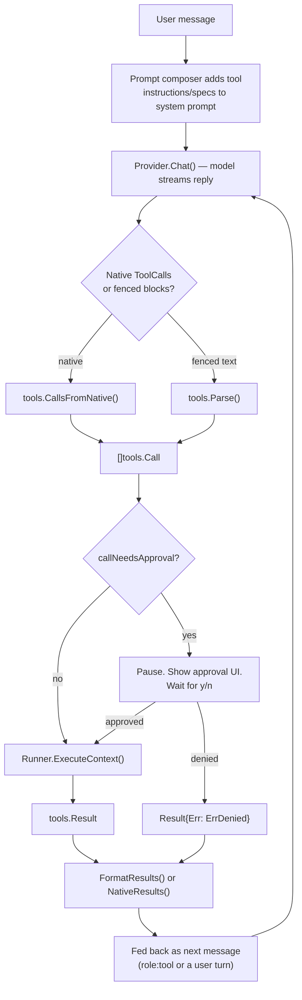

# How Tool-Calling Works in llmtui

Think of it like a restaurant. The **menu** (tool schema) is what the LLM reads and orders from. The **kitchen** (Go `Runner`) is what actually does the work — reads files, runs commands. The **waiter** (the TUI's tool loop in `internal/tui/app.go`) carries orders back and forth and enforces house rules (approval, sandboxing) before anything gets served. The LLM never touches your disk directly — it only ever emits text or JSON describing what it wants; Go code decides whether and how to actually do it.

## 1. The tool is a contract in two halves

Every built-in tool has two representations that must stay in sync:

- **Schema** — name, description, JSON-Schema parameters. This is what gets shown to the model.
- **Implementation** — a Go function that actually does the work, confined to the workspace.

`internal/tools/native.go`'s `Specs()` is the schema side:

```go
{
    Name:        ToolReadFile,
    Description: "Read a file in the project workspace and return its contents. Paths are relative to the project root.",
    Parameters: json.RawMessage(`{
        "type": "object",
        "properties": {
            "path": {"type": "string", "description": "File path relative to the project root."}
        },
        "required": ["path"]
    }`),
},
```

`internal/tools/tools.go`'s `Runner.ExecuteContext` is the implementation side — a plain switch on tool name:

```go
switch c.Tool {
case ToolReadFile:
    res.Output, res.Err = r.readFile(c.Path)
case ToolWriteFile:
    res.Output, res.Diff, res.Err = r.writeFile(c.Path, c.Body)
...
```

`provider.ToolSpec` (`internal/provider/provider.go:87`) is just `{Name, Description, Parameters}` — a plain struct, no magic. It gets attached to the outgoing request as `ChatRequest.Tools`.

## 2. Two ways the LLM finds out tools exist

llmtui supports both because local models vary wildly in function-calling quality:

**A. Native function calling** — for models/servers that support it (Ollama tools API, OpenAI-compatible `tools` field). The Go code sends a `ToolSpec` list in the request; the model's API contract handles the rest, and the response comes back as structured `ToolCall{ID, Name, Arguments}` objects, not text.

**B. Fenced-block fallback** — for any model, including ones with no function-calling support at all. Instead of a schema, the system prompt just *tells* the model the syntax in plain English (`tools.go:751`, `Instructions()`):

```
To use a tool, emit a fenced code block whose info string is "tool <name> [path]".

​```tool write_file scripts/hello.sh
#!/bin/sh
echo hello
​```
```

The model just writes that text as part of its reply. `tools.go:96`'s `Parse()` regexes it back out of the reply into the same `Call` struct that the native path produces. This is why the whole downstream pipeline — approval, execution, results — doesn't care which path was used; both funnel into `tools.Call`.

`m.useNativeTools()` (`app.go:1164`) decides which mode a given provider/model gets, and there's an automatic fallback: if a backend rejects `tools` in the request, llmtui remembers that and switches to fenced mode for that provider+model going forward (`resetNativeToolMode`, `app.go:1178`).

## 3. The full round trip



Concretely:

1. `Parse` (fenced) or `CallsFromNative` (native, `native.go:167`) both normalize into `[]tools.Call{ID, Tool, Path, Body, ...}` — one shared internal representation regardless of transport.
2. `m.startToolBatch(calls)` (`app.go:1107`) is the orchestrator. For each call, `callNeedsApproval` (`app.go:1084`) checks a layered policy: a time-limited grant from a previous "always allow" choice, then MCP server approval mode, then `Runner.NeedsApproval` which applies the guardrails (writes ask, non-read-only shell commands ask, secret-file reads ask, read-only stuff like `list_dir`/`glob` never asks).
3. If anything needs approval, the loop **stops** and shows the y/n prompt (`renderApprovalPrompt`, `app.go:2492`) — nothing executes until the user answers.
4. Approved calls run through `Runner.ExecuteContext` (`tools.go:246`) — serialized via a 1-slot channel so concurrent batches can't race on the workspace, every path resolved and symlink-checked against the workspace root, output size-capped, commands time-boxed.
5. Results go back to the model as either a synthetic user message wrapped in `[tool results]` (fenced mode, `FormatResults`) or as proper `role:"tool"` messages carrying `ToolCallID`/`ToolName` (native mode, `NativeResults`, `native.go:276`).
6. The model gets another turn with those results in context and can call more tools or answer normally. This repeats up to `tools.max_iterations` (default 10, `toolMaxIter`, `app.go:1155`) — after that the *user* decides whether to grant more rounds, so a long task never silently dies.

## 4. The registry is metadata, not execution

`internal/tools/registry.go` is a separate catalog (`CapabilityInfo{Name, Description, Source, Safety, Approval, Parameters}`) used by `/tools`, debug views, and future MCP/RAG capability listing. It reuses `Specs()` as source of truth so the docs never drift from the actual schema, but it does **not** execute anything — execution always goes through `Runner`. This is a nice separation: "what tools exist and what can they touch" (`Registry`) is decoupled from "how do I actually run one" (`Runner`).

## 5. Skills: they're prompt extensions, not code

`skill_load` genuinely is a "tool" in the schema/dispatch sense (it has a `ToolSpec`, goes through the approval/execution pipeline), but its Go implementation does **nothing except flip a flag** — see the doc comment at `tools.go:46`:

> "It executes no code and grants no permissions: the skill body is included by the prompt composer on the next inference."

So a "skill" isn't a capability at all — it's a labeled block of instructions that `internal/prompt` splices into the system prompt once activated. The `skill_load` tool is just the mechanism by which the *model itself* can request that a particular instruction block be added to its own context on the next turn.

---

## Worked example: a `brush_teeth` tool

Say you want a (harmless, illustrative) tool the model can call with parameters like duration and brush type. Here's every surface you'd touch, following the "Add or change a workspace tool" checklist — **shown only, nothing applied to the codebase**.

**1. Name the tool** — `tools.go:37`:

```go
const ToolBrushTeeth = "brush_teeth"
```

**2. Native schema** — `internal/tools/native.go`, added to `Specs()`:

```go
{
    Name:        ToolBrushTeeth,
    Description: "Brush teeth for a given duration using a chosen technique.",
    Parameters: json.RawMessage(`{
        "type": "object",
        "properties": {
            "duration_seconds": {"type": "integer", "description": "How long to brush, in seconds."},
            "technique":        {"type": "string", "enum": ["manual", "electric"], "description": "Brushing technique."}
        },
        "required": ["duration_seconds", "technique"],
        "additionalProperties": false
    }`),
},
```

This is what the model actually reads — the schema *is* the documentation the LLM reasons from. Tight `enum`/`required`/`additionalProperties` constraints matter: they're what stops the model from inventing a `"technique": "ultrasonic"` your Go code doesn't handle.

**3. Argument mapping** — extend `nativeArgs` and `CallsFromNative` (`native.go:90` / `native.go:167`):

```go
type nativeArgs struct {
    ...
    DurationSeconds int    `json:"duration_seconds"`
    Technique       string `json:"technique"`
}
```

```go
case ToolBrushTeeth:
    c.Max = args.DurationSeconds   // reusing an existing int field, or add a dedicated one on Call
    c.Filter = args.Technique
```

(In a real change you'd likely add dedicated fields to `Call` rather than repurpose `Max`/`Filter` — those happen to be free integer/string slots today, but a real PR should give `brush_teeth` its own named fields for clarity.)

**4. Fenced-block fallback text** — `tools.go:751`'s `Instructions()`, so non-native models can still call it:

```
- brush_teeth <technique> — brush teeth; the block body is the duration in seconds
```

with a parser rule in `Parse`/the doc comment showing:

```
​```tool brush_teeth electric
120
​```
```

**5. Implementation** — a case in `Runner.ExecuteContext` (`tools.go:266`):

```go
case ToolBrushTeeth:
    res.Output, res.Err = r.brushTeeth(c.Filter, c.Max)
```

```go
func (r *Runner) brushTeeth(technique string, seconds int) (string, error) {
    if seconds <= 0 {
        return "", fmt.Errorf("brush_teeth needs a positive duration")
    }
    if technique != "manual" && technique != "electric" {
        return "", fmt.Errorf("unknown technique %q", technique)
    }
    return fmt.Sprintf("brushed teeth for %ds using %s technique", seconds, technique), nil
}
```

Note this tool touches no filesystem and no process — so unlike `write_file`/`run_command` it wouldn't need path resolution or sandboxing at all. It's a good illustration that the safety machinery (`resolve`, symlink checks, command classification) is opt-in per tool, applied only where a tool can actually touch something.

**6. Safety classification & approval policy** — `internal/tools/registry.go`:

```go
safetyForBuiltin[ToolBrushTeeth] = SafetyReadOnly     // or a new class if it had side effects
approvalForTool[ToolBrushTeeth]  = "no"               // no side effects worth confirming
```

And in `NeedsApproval` (`tools.go:529` / `tools.go:544`) it'd fall into the default `switch` case — which currently means "true" (ask) unless explicitly listed as safe. You'd add it to the no-approval branch if it's genuinely harmless.

**7. Register it in the `DefaultRegistry`** loop that already iterates `Specs()` — nothing extra needed there, it's automatic once step 2 is done.

**8. Tests** — per the playbook: parser/native-conversion test, a success case, a failure case (bad technique/negative duration), and an approval-classification test confirming it does *not* prompt.

That's the whole shape: **schema → parse/convert → approval gate → sandboxed execution → structured result → fed back to the model**. Every real tool in this codebase (`read_file`, `write_file`, `run_command`, `web_fetch`, MCP tools) is this same skeleton with different amounts of guardrail machinery bolted onto step 5 depending on what it's capable of touching.
